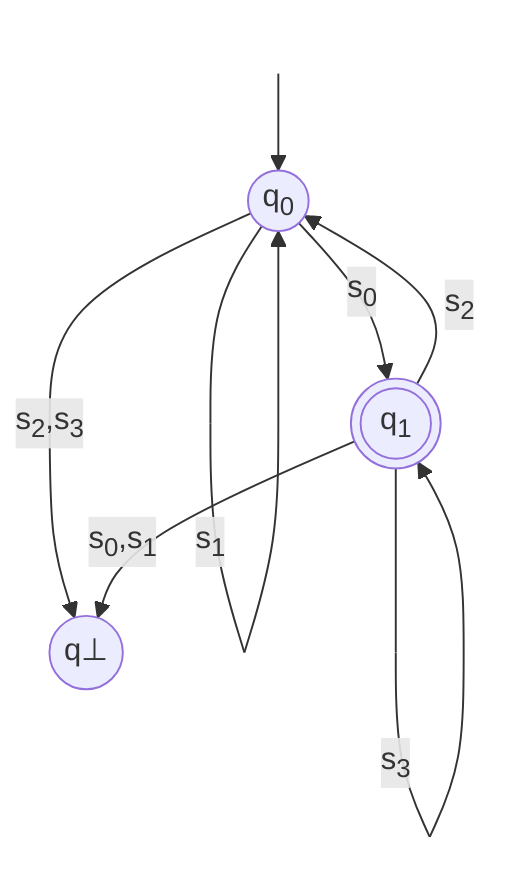
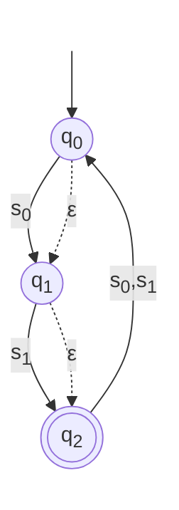

# Automata Theory (The Mathematical Foundations)

## Definition

Formally, a **deterministic finite automata (DFA)** is a **5-tuple $(Q,\Sigma,\delta,q_0,F)$** where:

 - **$Q$** is a **finite set of states**.
 - **$\Sigma$** is a **finite set of symbols** called **alphabet**.
 - **$\delta:Q \times \Sigma \rightarrow Q$** the **total transition function** that maps a tuple ***(state,symbol)*** to an state.
 - **$q_0 \in Q$** the initial state of the automata.
 - **$F \subseteq Q$** the set of ***accepting* states** called **final states**.

## Tabular Representation (Transition Table)

The transition function $\delta$ can be conveniently represented as a state-transition table. Rows correspond to states, columns to alphabet symbols, and each cell contains the resulting target state.

!!! importante
    Since a DFA requires a total function, every cell in the table must be filled. If a transition is not explicitly defined for a given *(state, symbol)*, we introduce an **implicit *dead* state** (often denoted $\varnothing$ or $q\bot$) that is not in $F$ and loops back to itself on all symbols.

> ### Example

Let’s define a DFA *A* where:

 - $Q = \lbrace q_0, q_1, q\bot\rbrace$.

 - $\Sigma = \lbrace s_0, s_1, s_2, s_3\rbrace$.

 - $q_0$ is the start state.

 - $F = \lbrace q_1 \rbrace$ (only $q_1$ is accepting).

 - $\delta$ is given as:
    - $\delta(q_0, s_0) = q_1, \delta(q_0, s_1) = q_0$,
    - $\delta(q_1, s_2) = q_0, \delta(q_1, s_3) = q_1$,
    - and all remaining transitions go to the dead state $q\bot$.

The transition table is:

| **State** | **$s_0$** | **$s_1$** | **$s_2$** | **$s_3$** |
| :---: | :---: | :---: | :---: | :---: |
| **$\rightarrow q_0$** | $q_1$ | $q_0$ | $q\bot$ | $q\bot$ |
| **$*q_1$** | $q\bot$ | $q\bot$ | $q_0$ | $q_1$ |
| **$q\bot$** | $q\bot$ | $q\bot$ | $q\bot$ | $q\bot$ |

#### **Legend**

 - $ \rightarrow $ : denotes the **initial state**.
 - $*$ (or double circle in diagrams) : denotes an **accepting state**.
 - $q\bot$ : is the **dead**(non-accepting) state.

## Extended Transition Function ($\hat{\delta}$)

To define acceptance of strings (not just single symbols), we extend $\delta$ to operate on $\Sigma^*$ (the set of all finite strings over $\Sigma$). We define the **extended transition function**:

$$
\hat{\delta} : Q \times \Sigma^* \rightarrow Q
$$

recursively as follows:

 - **Base case (empty string $\epsilon$)**:

$$
\hat{\delta}\lparen q, \epsilon\rparen = q
$$

*Interpretation*: Without consuming any input, the automaton stays in its current state.

 - **Recursive step (string $w = xa$), where $x \in \Sigma^*$ and $a \in \Sigma$**

$$
\hat{\delta}\lparen q,xa) = \delta\lparen\hat{\delta}\lparen q,x \rparen , a \rparen
$$

*Interpretation*: To process $xa$, first process the prefix $x$ (reaching an intermediate state), then apply the normal transition $\delta$ with the final symbol $a$.

Since $\delta$ is total, $\hat{\delta}$ is also total: **every** possible input string leads to exactly one well-defined state.

## Acceptance Condition (Language of the DFA)

A string $w \in \Sigma^*$ is **accepted** by the DFA $A$ if, starting from the initial state $q_0$ and processing the entire string, the automaton ends in a state that belongs to the set of finals states $F$.

Formally, the **language recognized**(or accepted) by $A$ is:

$$
L\lparen A \rparen = \lbrace w \in \Sigma^* : \hat{\delta} \lparen q_0,w \rparen \in F \rbrace
$$

A string is **rejected** if the final state is not in $F$. Thanks to the explict dead state $q\bot$, any string that encounters an undefined transition ends up in $q\bot$, guaranteeing rejection.

> ### Acceptance Examples (Using DFA $A$)

Let's us test a few string over $\Sigma = \lbrace s_0,s_1,s_2,s_3 \rbrace$:

| **String $w$** | **Computation ($\hat{\delta}\lparen q_0,w\rparen$)** | **Final State** | **In $F$?** | **Veredict** |
| :---: | :---: | :---: | :---: | :---: |
| **$s_0s_3$** | $\delta\lparen q_0,s_0\rparen = q_1$, then $\delta\lparen q_1,s_3 \rparen = q_1$ | $q_1$ | Yes | Accepted ✅ |
| **$s_0s_2$** | $\delta\lparen q_0,s_0\rparen = q_1$, then $\delta\lparen q_1,s_2 \rparen = q_0$ | $q_1$ | No | Rejected ❌ |
| **$s_0s_1$** | $\delta\lparen q_0,s_0\rparen = q_1$, then $\delta\lparen q_1,s_1 \rparen = q\bot$ | $q\bot$ | No | Rejected ❌ |

Notice that the DFA does not *"know"* whether it will accept until it has **consumed the entire input string**. Acceptance depends solely on the state where the computation halts.

## Graphical Representation (State Transition Diagram)

In addition to the formal tuple and the transition table, a DFA is often visualized using a **state transition diagram**, a **directed labeled graph**. This representation is invaluable for human understanding, design, and debugging.

> ### Conventions for drawing a DFA

| **Component** | **Graphical convention** |
| :---: | :---: |
| **States ($Q$)** | Circles (or nodes). |
| **Initial state ($q_0$)** | An incoming arrow with no origin (pointing to the circle). |
| **Accepting states ($F$)** | Double circles (concentric circles). |
| **Transitions ($\delta$)** | Directed edges (arrows) from state $p$ to state $q$, labeled with the symbol $a \in \Sigma$ for which $\delta\lparen p,a \rparen = q$ |

!!! tip "Crucial visual property of a DFA"
    From **every state**, and for **each symbol** in $\Sigma$, there must be **exactly one outgoing edge** with that label. This visually enforces the totality of $\delta$.

> ### Graphical representation of DFA $A$

!!! tip "Interpreting paths"
    - A string is accepted if following its symbols as edge labels from $q_0$ ends at a **double-circle** node.
    - Any path ending at $q\bot$ (or  any single-circle node $q \notin F$), means rejection.

> ### On Omitting the Dead State

In many introductory textbooks or informal diagrams, the dead state $q\bot$ is omitted to reduce visual clutter. In such cases, missing outgoing edges are implicitly understood as "rejection traps." However, for formal rigor, especially when emphasizing the totality of $\delta$, it is highly recommended to include $q\bot$ explicitly in the diagram. This makes it clear that the automaton never gets stuck and always produces a definitive outcome.

> ### Equivalence of Representations

The three representations are fully interchangeable and mathematically equivalent. Each serves a distinct purpose:

| **Rpresentation** | **Formality Level** | **Best Used For** |
| :---: | :---: | :---: |
| **Tuple $\lparen Q,\Sigma,\delta,q_0,F\rparen$** | Most formal and precise. | Theoretical proofs, formal language definitions, and algorithmic specifications. |
| **Transition Table** | Concise and structured. | Implementation (e.g., matrix representation in code) and quick lookup. |
| **State Diagram (Graph)** | Intuitive and visual. | Human comprehension, system design, debugging, and educational explanation. |

## The Hybrid $\epsilon$-DFA (A Deterministic Core with Spontaneous Moves)

To simplify the construction of complex languages (union, concatenation, star) while keeping symbol consumption fully deterministic, we introduce an elegant intermediate model: **the hybrid $\epsilon$-DFA**.

We define the hybrid $\epsilon$-DFA as a 6-tuple:

$$
A = \lparen Q,\Sigma,\delta,\epsilon,q_0,F \rparen
$$

Where every $\epsilon \subseteq Q \times Q$ is an **epsilon relation** (a set of spontaneous moves), the rest of the components has the same definition from DFA.

!!! note "Key insight"
    Nondeterminism is not in reading symbols (that remains deterministic) but purely in the ability to take $\epsilon$-moves at any time. This separation makes the model mathematically tidy and exceptionally convenient for language operations.

> ### Tabular Representation

The transition table now has a **separate column** for $\epsilon$‑destinations.

| **State** | **$s_0$** | **$s_1$** | **$\epsilon$-destination** |
| :---: | :---: | :---: | :---: |
| **$\rightarrow q_0$** | $q_1$ |  $q_0$ | $\lbrace q_2 \rbrace$ |
| **$q_1$** | $q\bot$ | $q_1$ | $\varnothing$ |
| **$*q_2$** | $q_2$ | $q\bot$ | $\lbrace q_0 \rbrace$ |

Every cell under alphabet symbols contains a single state (deterministic), while the $\epsilon$‑cell contains a set of states (possibly empty).

> ### Extended Transition Function and $\epsilon$‑Closure

Because $\epsilon$‑moves can be taken spontaneously before, between, and after reading symbols, we must define the $\epsilon$‑closure with respect to the relation $\epsilon$.

For any set of states $S \subseteq Q$:

 - **Base case**: $S \subseteq \epsilon-Closure \lparen S \rparen$.
 - **Inductive**: If $p \in \epsilon-Closure \lparen S \rparen$ and $\lparen p,r \rparen \in \epsilon$, then $r \in \epsilon-Closure \lparen S \rparen$.

The extended transition function $\hat{\delta}:Q \times \Sigma^* \rightarrow 2^Q$ is defined as:

 - **Base case**(empty string):

$$
\hat{\delta}\lparen q,\epsilon \rparen = \epsilon-Closure \lparen\lbrace q \rbrace\rparen
$$

 - **Recursive step**(string $w = xa$, with $x \in \Sigma^*$, $a \in \Sigma $): Let $S = \hat{\delta}\lparen q,x \rparen$. Since $\delta$ is deterministic, we define:

$$
move\lparen S, a \rparen = \lbrace \delta \lparen p, a\rparen : p \in S \rbrace
$$

Then:

$$
\hat{\delta}\lparen q,xa \rparen = \epsilon-Closure \lparen move \lparen S, a \rparen \rparen
$$

Notice how $\delta$ is applied pointwise to the set $S$, because it is deterministic, the result is still a set of states, but each element comes from a unique source.

> ### Acceptance Condition

A string $w \in \Sigma^*$ is accepted if, after processing all symbols (with $\epsilon$‑closures applied before and after each step), there exists at least one possible resulting state that is final:

$$
L\lparen A \rparen = \lbrace w \in \Sigma^* : \hat{\delta}\lparen q_0,w \rparen \cap F \neq \varnothing \rbrace
$$

This existential condition is the hallmark of the nondeterminism introduced solely by $\epsilon$‑moves.

> ### Graphical Representation

The diagram for a hybrid $\epsilon$‑DFA uses two distinct edge styles:

 - **Solid edges for alphabet symbols**. From each state, there is exactly one solid outgoing edge per symbol (deterministic).
 - **Dashed (or dotted) edges** labelled $\epsilon$ for spontaneous moves. Multiple $epsilon$‑edges may emanate from a single state, creating nondeterministic branching.

The tracing of an input string involves:

 - `1`: Taking any number of dashed $\epsilon$‑edges ($\epsilon$-Closure) for free.

 - `2`: Following the unique solid edge labelled with the next input symbol.

 - `3`: Repeating the $\epsilon$‑Closure after each step.

 - `4`: Accepting if any branch ends on a double‑circle (final) state.

## Regular Languages

A language $L \subseteq \Sigma^*$ is called a **regular language** if and only if there exists a finite automaton (DFA, standard NFA, $\epsilon$‑NFA, or our hybrid $\epsilon$‑DFA) that recognises it. **By Kleene's Theorem**, regular languages are exactly those expressible by regular expressions (built from $\varnothing$, $\lbrace \epsilon \rbrace$, $\lbrace a \rbrace$ for $a \in \Sigma$, and closed under union, concatenation, and Kleene star). This theorem establishes the foundational equivalence between automata, expressions, and regular grammars.

> ### Formal Relationship Between DFA and the Hybrid $\epsilon$‑DFA

The hybrid $\epsilon$‑DFA is not a new class of languages; it is computationally equivalent to the standard DFA. We establish this through mutual transformation.

#### Every DFA is a Trivial Hybrid $\epsilon$‑DFA

Given a DFA $A_D = \lparen Q,\Sigma,\delta_D,q_0,F \rparen$, construct a hybrid $\epsilon$‑DFA $A_H$ with the same $Q,\Sigma,q_0,F$, set $\delta_H\lparen q,a \rparen = \delta_D \lparen q,a \rparen$, and define the epsilon relation $\epsilon = \varnothing$. Then $\epsilon-Closure \lparen S \rparen = S$ for all $S$, and $\hat{\delta}_H$ behaves exactly like $\hat{\delta}_D$.

Therefore $L\lparen A_D \rparen = L \lparen A_H \rparen$.

#### Every Hybrid $\epsilon$‑DFA can be Converted to an Equivalent DFA

This is achieved via the **subset (powerset)** construction, adapted for the separated $\delta$ and $\epsilon$:

Given $A_H = \lparen Q,\Sigma,\delta,\epsilon,q_0,F \rparen$, we build a DFA $A_D = \lparen Q^{'},\Sigma,\delta^{'},q_0^{'},F^{'} \rparen$:

 - $Q^{'} \subseteq 2^Q$ (each state of the DFA is a subset of original states).
 - Initial state: $q_0^{'} = \epsilon-Closure \lparen \lbrace q_0 \rbrace \rparen$.
 - Transition function: For any subset $S \in Q^{'}$ and $a \in \Sigma$:

$$
\delta^{'}\lparen S,a \rparen = \epsilon-Closure \lparen \cup_{p \in S}\lbrace \delta \lparen p,a \rparen \rbrace \rparen
$$

 Since $\delta \lparen p,a \rparen$ yields exactly one state, the union is well-defined.

 - Accepting states: $F^{'} = \lbrace S \subseteq Q : S \cap F \neq \varnothing \rbrace$.

Because $Q$ is finite, $Q^{'}$ is finite. By construction, $L\lparen A_D \rparen = L \lparen A_H \rparen$.

**Conclusion**: Despite its syntactic differences, the hybrid $\epsilon$‑DFA recognises exactly the regular languages, just like the classic DFA.

> ### Operations on Regular Languages (Superficial Overview)

One of the most powerful features of regular languages is their closure under a wide variety of operations. Applying these operations to regular languages always yields another regular language. The hybrid $\epsilon$‑DFA model offers intuitive constructive proofs for several key operations.

| **Operation** | **Symbolic definition** |
| :---: | :---: |
| **Union** | $L_1 \cup L_2  = \lbrace w : w \in L_1 \lor w \in L_2 \rbrace$ |
| **Concatenation** | $L_1 \cdot L_2 = \lbrace w_1w_2 : w_1 \in L_1 \land w_2 \in L_2 \rbrace$ |
| **Kleene Star** | $L^* = \cup_{i \geq 0}L^i$ (zero or more repetitions) |
| **Complement** | $\overline{L} = \Sigma^* \setminus L$ |
| **Intersection** | $L_1 \cap L_2 = \lbrace w : w \in L_1 \land w \in L_2 \rbrace$

!!! note "Remark on the hybrid model"
    While union, concatenation, and star are almost trivial with our separated $\epsilon$‑relation, complement and intersection are more naturally handled after converting to a fully deterministic DFA. This does not diminish the model’s utility; rather, it illustrates the flexibility of automata theory, choosing the representation that best fits the task at hand, knowing they are all fundamentally equivalent.

## Next Step

After all these theoretical explanations, we are now ready to delve into the API of the `automaton` module of PyLGEN.