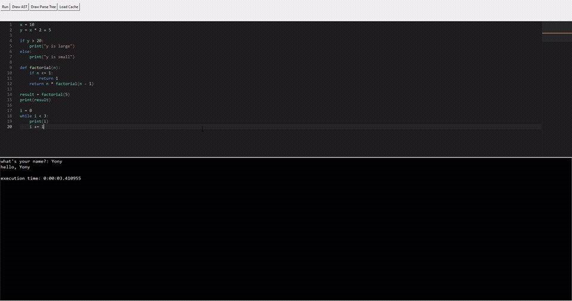
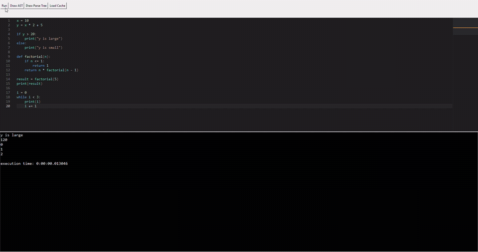
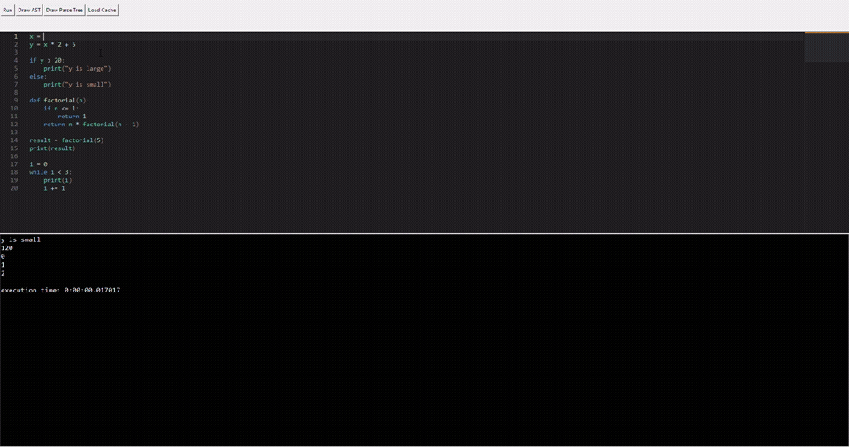
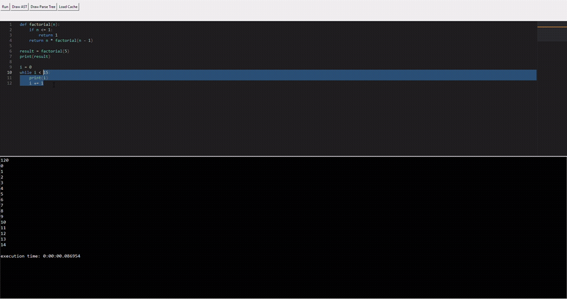
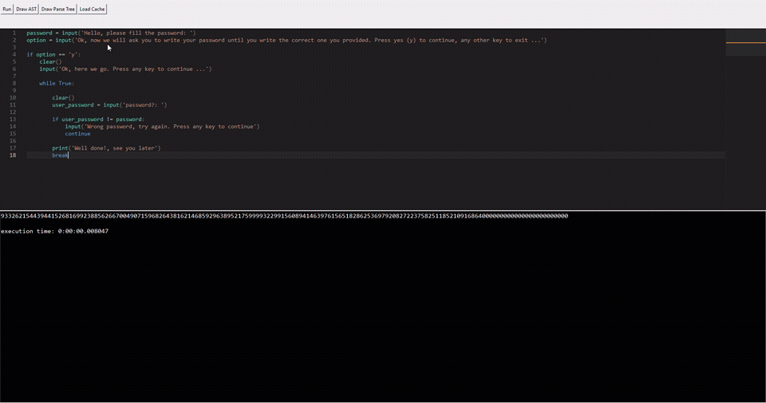

# The Python Subset: a complete interpreter with a GUI

You've seen how a small DSL can be built with a few hundred lines of declarative code. But what happens when the language grows? What happens when you need variables, control flow, user‑defined functions, and a proper user interface to boot? That's the question `mini-python` answers.

`mini-python` is a complete interpreter for a subset of Python, wrapped in a GUI editor built on Tkinter using `cupcacke-editor` for the text editor.

It supports:

 - **arithmetic**: `+`,`-`,`*`,`/`,`//`,`**`,`%`.
 - **strings**: `''` and `""`. 
 - **booleans**: `True`,`False`,`not`,`and`,`or`.
 - **comparisons**: `==`,`!=`,`<`,`>`,`<=`,`>=`.
 - **bitwise operations**: `|` and `&`.
 - **compound assignments**: `+=`,`-=`,`*=`,`/=`,`//=`,`**=`,`%=`. 
 - **control flow**: `if`,`elif`,`else`.
 - **while loops**: `while`.
 - **user‑defined functions**: `def name(...):`
 - **built-ins**: `print`,`clear`,`exit`,`input`.
 - **more**: `return`, `break` and `continue` instructions.

It's expressive enough to write non‑trivial programs, yet compact enough to understand in a single sitting. And crucially, it uses every part of PyLGEN: the indentation‑aware lexer, the attributed grammar, the visitor pattern, custom traversal strategies, and even the visualization submodule.

!!! note "Sources"
    The source code of the entire example can be found on the [github repository](https://github.com/YonyUk/pylgen/tree/master/examples/mini-python)

    [download source code<br>(mini-python)](https://download-directory.github.io/?url=https://github.com/YonyUk/pylgen/tree/master/examples/mini-python){ .md-button .md-button--primary style="text-align: center;"}

## The starting point: what the language supports

Before diving into the code, let's look at what a `mini-python` program looks like:

```python
x = 10
y = x * 2 + 5

if y > 20:
    print("y is large")
else:
    print("y is small")

def factorial(n):
    if n <= 1:
        return 1
    return n * factorial(n - 1)

result = factorial(5)
print(result)

i = 0
while i < 3:
    print(i)
    i += 1
```

It looks like Python, and that's the point. The indentation is significant, the keywords are familiar, and the operators behave as you'd expect. What makes it interesting is that it's not Python, it's a subset implemented entirely with PyLGEN, and its grammar is written by hand.

## First stop: the indentation‑aware lexer

The lexer is very similar to the one in `idented_dsl`, with a few extra token types to handle strings, booleans, and the various operators.

File: `tokens.py`

```python
from pylgen.common.enums import TokenType

class PythonTokenType(TokenType):

    INTEGER = 'INTEGER'
    BOOLEAN = 'BOOLEAN'
    FLOATING = 'FLOATING'
    STRING = 'STRING'
    SYMBOL = 'SYMBOL'
    OPERATOR = 'OPERATOR'
    EOF = 'EOF'
    JUMPLINE = 'JUMPLINE'
    IDENTATION = 'IDENTATION'
    KEYWORD = 'KEYWORD'
    IDENTIFIER = 'IDENTIFIER'
    WHITESPACE = 'WHITESPACE'
    WHITESPACEMARKER = 'WHITESPACEMAKER'
```

The lexer itself is built with `IdentedLexer`, the same class we used for `idented_dsl`. But this time, the mapping function is richer, and it dispatches on more token types.

File: `lexer.py`

```python
from pylgen.lexer import IdentedLexer
from pylgen.common.types import Symbol
from pylgen.analysis import LexicalRule

from grammar.symbols import *

from .tokens import PythonTokenType

class IntegerLexicalRule(LexicalRule):

    def __init__(self) -> None:
        super().__init__('non-zero integers cannot start with 0 digit')

    def _check(self, text: str):
        return len(text) == 1 or text[0] != '0'

class FloatingLexicalRule(LexicalRule):

    def __init__(self) -> None:
        super().__init__('non-zero numbers must have at most one 0 digit at the start')

    def _check(self,text:str):
        if len(text) <= 3:
            return True
        if text[0] == '0':
            if text[1] not in ['.','e']:
                return False
            return True
        return True

class VariableLexicalRule(LexicalRule):

    def __init__(self) -> None:
        super().__init__('variables names must starts with a non-digit character')

    def _check(self, text: str):
        return not text[0].isdigit()

whitespace = Symbol('whitespace',True)
invalid_token = Symbol('INVALID_TOKEN',True)

operators = {
    '+':plus,
    '-':minus,
    '*':mul,
    '/':div,
    '//':int_div,
    '%':mod,
    '**':power,
    '==':eq,
    '=':assign,
    'or':or_op,
    'and':and_op,
    'not':not_op,
    '|':bit_or,
    '&':bit_and,
    '!=':neq,
    '<':le,
    '>':ge,
    '<=':leq,
    '>=':geq,
    '+=':plus_eq,
    '-=':minus_eq,
    '*=':mul_eq,
    '/=':div_eq,
    '//=':int_div_eq,
    '**=':power_eq,
    '|=':bit_or_eq,
    '&=':bit_and_eq,
    '%=':mod_eq
}

symbols = {
    '(':lparen,
    ')':rparen,
    ',':comma,
    ':':colon
}

keywords = {
    'print':print_keyword,
    'clear':clear_keyword,
    'exit':exit_keyword,
    'if':if_keyword,
    'elif':elif_keyword,
    'else':else_keyword,
    'while':while_keyword,
    'input':input_keyword,
    'def':def_keyword,
    'return':return_keyword,
    'break':break_keyword,
    'continue':continue_keyword
}

def get_symbol_function(t:PythonTokenType,tx:str) -> Symbol:
    if t == PythonTokenType.INTEGER:
        return int_number
    if t == PythonTokenType.FLOATING:
        return float_number
    if t == PythonTokenType.STRING:
        return string
    if t == PythonTokenType.SYMBOL:
        return symbols[tx]
    if t == PythonTokenType.OPERATOR:
        return operators[tx]
    if t == PythonTokenType.IDENTATION:
        return indent
    if t == PythonTokenType.KEYWORD:
        return keywords[tx]
    if t == PythonTokenType.WHITESPACE or t == PythonTokenType.WHITESPACEMARKER:
        return whitespace
    if t == PythonTokenType.JUMPLINE:
        return jumpline
    if t == PythonTokenType.BOOLEAN:
        return boolean
    if t == PythonTokenType.IDENTIFIER:
        return identifier
    return invalid_token

def sanitaze_function(t:str) -> str:
    new_lines = []
    for line in t.splitlines():
        if line.strip() == '':
            new_lines.append('#ignore#')
        else:
            new_lines.append(line)
    return '\n'.join(new_lines) + '\n'

PythonLexer = IdentedLexer(get_symbol_function,'#ignore#\n?')
PythonLexer.set_eof_token('\x00',PythonTokenType.EOF)
PythonLexer.set_ident(PythonTokenType.IDENTATION)
PythonLexer.set_indent_symbol(indent)
PythonLexer.set_dedent_symbol(dedent)
PythonLexer.set_text_sanitize_function(sanitaze_function)

PythonLexer[0,PythonTokenType.INTEGER] = r'\d+'
PythonLexer[1,PythonTokenType.FLOATING] = r'(\d+)?\.\d+|\d+e(\+|\-)?\d+'
PythonLexer[2,PythonTokenType.BOOLEAN] = 'True|False'
PythonLexer[3,PythonTokenType.KEYWORD] = 'print|clear|exit|if|elif|else|while|input|def|return|break|continue'
PythonLexer[4,PythonTokenType.OPERATOR] = r'\+=?|\-=?|\*\*?=?|//?=?|%=?|==?|or|and|not|\|=?|&=?|!=|<=?|>=?'
PythonLexer[5,PythonTokenType.IDENTIFIER] = r'\w+'
PythonLexer[6,PythonTokenType.SYMBOL] = r'\(|\)|\,|:'
PythonLexer[7,PythonTokenType.IDENTATION] = '    |\t'
PythonLexer[8,PythonTokenType.WHITESPACE] = ' '
PythonLexer[9,PythonTokenType.WHITESPACEMARKER] = '#ignore#\n?'
PythonLexer[10,PythonTokenType.JUMPLINE] = '\n'
PythonLexer[11,PythonTokenType.STRING] = '"[^"]*"|\'[^\']*\''

PythonLexer.add_rule(PythonTokenType.INTEGER,IntegerLexicalRule())
PythonLexer.add_rule(PythonTokenType.FLOATING,FloatingLexicalRule())
PythonLexer.add_rule(PythonTokenType.IDENTIFIER,VariableLexicalRule())

print('initializing lexer...')
PythonLexer.initialize()
print('done')
```

Notice the use of dictionaries for operators, symbols, and keywords. This is a small optimization: instead of a long `if`/`elif` chain, we do a single dictionary lookup. It keeps the function readable and fast.

The token patterns are registered in priority order, with the more specific patterns first. The `sanitize_function` is the same trick we saw before: empty lines are replaced by `#ignore#`, a marker the lexer discards. This prevents blank lines from triggering spurious `indent` or `dedent` tokens. Finally, the lexer is configured with the indentation tokens and the sanitizer. Three lexical rules add an extra layer of validation: integers can't start with a leading zero, floats must be well‑formed, and identifiers can't start with a digit. These are simple checks, but they catch common mistakes early.

## Second stop: the attributed grammar

The grammar is where the language really takes shape. It's organized into precedence levels, from lowest to highest:

 - **`BoolExpr`**: logical `or`, bitwise `|`.
 - **`BoolTerm1`**: logical `and`, bitwise `&`.
 - **`BoolTerm2`**: unary boolean expressions.
 - **`UnaryBoolExpr`**: `not`.
 - **`UnaryBoolExpr1`**: comparisons (`==`, `!=`, `<`, `<=`, `>`, `>=`).
 - **`MathExpr`**: unary minus.
 - **`UnaryMathExpr`**: addition and subtraction.
 - **`Term1`**: multiplication, division, integer division, modulo.
 - **`Term2`**: exponentiation.
 - **`Term3`**: atoms (numbers, booleans, strings, function calls, variables, parentheses).

File: `grammar.py`

```python
from pylgen.grammar import AttributedGrammar
from pylgen.parser import ParserBuilder,ParserType

from .symbols import *
from .reductors import *

G = AttributedGrammar(PythonProgram)

G[PythonProgram] += (PythonInstructions,),single_reductor

G[PythonInstructions] += (PythonInstruction,),Instructions_reductor
G[PythonInstructions] += (PythonInstructions,PythonInstruction),Instructions_Instruction_reductor

G[PythonInstruction] += (BoolExpr,jumpline),PythonInstruction_BoolExpr_reductor
G[PythonInstruction] += (Variable,assign,BoolExpr,jumpline),PythonInstruction_Variable_assign_BoolExpr_reductor
G[PythonInstruction] += (Variable,plus_eq,MathExpr,jumpline),PythonInstruction_Variable_plus_eq_MathExpr_reductor
G[PythonInstruction] += (Variable,minus_eq,MathExpr,jumpline),PythonInstruction_Variable_minus_eq_MathExpr_reductor
G[PythonInstruction] += (Variable,mul_eq,MathExpr,jumpline),PythonInstruction_Variable_mul_eq_MathExpr_reductor
G[PythonInstruction] += (Variable,div_eq,MathExpr,jumpline),PythonInstruction_Variable_div_eq_MathExpr_reductor
G[PythonInstruction] += (Variable,int_div_eq,MathExpr,jumpline),PythonInstruction_Variable_int_div_eq_MathExpr_reductor
G[PythonInstruction] += (Variable,power_eq,MathExpr,jumpline),PythonInstruction_Variable_power_eq_MathExpr_reductor
G[PythonInstruction] += (Variable,mod_eq,MathExpr,jumpline),PythonInstruction_Variable_mod_eq_MathExpr_reductor
G[PythonInstruction] += (Variable,bit_or_eq,BoolExpr,jumpline),PythonInstruction_Variable_bit_or_eq_BoolExpr_reductor
G[PythonInstruction] += (Variable,bit_and_eq,BoolExpr,jumpline),PythonInstruction_Variable_bit_and_eq_BoolExpr_reductor
G[PythonInstruction] += (return_keyword,BoolExpr,jumpline),PythonInstruction_return_keyword_BoolExpr_reductor
G[PythonInstruction] += (return_keyword,jumpline),PythonInstruction_return_keyword_reductor
G[PythonInstruction] += (break_keyword,jumpline),Break_reductor
G[PythonInstruction] += (continue_keyword,jumpline),Continue_redutctor
G[PythonInstruction] += (IfSmt,),single_reductor
G[PythonInstruction] += (IfElseSmt,),single_reductor
G[PythonInstruction] += (IfElifSmt,),single_reductor
G[PythonInstruction] += (IfElifElseSmt,),single_reductor
G[PythonInstruction] += (WhileSmt,),single_reductor
G[PythonInstruction] += (FuncDef,),single_reductor

G[BoolExpr] += (BoolExpr,or_op,BoolTerm1),BoolExpr_or_op_BoolTerm1_reductor
G[BoolExpr] += (BoolExpr,bit_or,BoolTerm1),BoolExpr_bit_or_BoolTerm1_reductor
G[BoolExpr] += (BoolTerm1,),single_reductor

G[BoolTerm1] += (BoolTerm1,and_op,BoolTerm2),BoolTerm1_BoolTerm1_and_op_BoolTerm2_reductor
G[BoolTerm1] += (BoolTerm1,bit_and,BoolTerm2),BoolTerm1_BoolTerm1_bit_and_BoolTerm2_reductor
G[BoolTerm1] += (BoolTerm2,),single_reductor

G[BoolTerm2] += (UnaryBoolExpr,),single_reductor

G[UnaryBoolExpr] += (not_op,UnaryBoolExpr),UnaryBoolExpr_not_op_UnaryBoolExpr_reductor
G[UnaryBoolExpr] += (UnaryBoolExpr1,),single_reductor

G[UnaryBoolExpr1] += (UnaryBoolExpr1,eq,MathExpr),UnaryBoolExpr1_UnaryBoolExpr1_eq_MathExpr_reductor
G[UnaryBoolExpr1] += (UnaryBoolExpr1,neq,MathExpr),UnaryBoolExpr1_UnaryBoolExpr1_neq_MathExpr_reductor
G[UnaryBoolExpr1] += (UnaryBoolExpr1,le,MathExpr),UnaryBoolExpr1_UnaryBoolExpr1_le_MathExpr_reductor
G[UnaryBoolExpr1] += (UnaryBoolExpr1,leq,MathExpr),UnaryBoolExpr1_UnaryBoolExpr1_leq_MathExpr_reductor
G[UnaryBoolExpr1] += (UnaryBoolExpr1,ge,MathExpr),UnaryBoolExpr1_UnaryBoolExpr1_ge_MathExpr_reductor
G[UnaryBoolExpr1] += (UnaryBoolExpr1,geq,MathExpr),UnaryBoolExpr1_UnaryBoolExpr1_geq_MathExpr_reductor
G[UnaryBoolExpr1] += (MathExpr,),single_reductor

G[MathExpr] += (minus,UnaryMathExpr),MathExpr_minus_UnaryMathExpr_reductor
G[MathExpr] += (UnaryMathExpr,),single_reductor

G[UnaryMathExpr] += (UnaryMathExpr,plus,Term1),MathExpr_MathExpr_plus_Term1_reductor
G[UnaryMathExpr] += (UnaryMathExpr,minus,Term1),MathExpr_MathExpr_minus_Term1_reductor
G[UnaryMathExpr] += (Term1,),single_reductor

G[Term1] += (Term1,mul,Term2),Term1_Term1_mul_Term2_reductor
G[Term1] += (Term1,mul,minus,Term2),Term1_Term1_mul_minus_Term2_reductor
G[Term1] += (Term1,div,Term2),Term1_Term1_div_Term2_reductor
G[Term1] += (Term1,div,minus,Term2),Term1_Term1_div_minus_Term2_reductor
G[Term1] += (Term1,int_div,Term2),Term1_Term1_int_div_Term2_reductor
G[Term1] += (Term1,int_div,minus,Term2),Term1_Term1_int_div_minus_Term2_reductor
G[Term1] += (Term1,mod,Term2),Term1_Term1_mod_Term2_reductor
G[Term1] += (Term1,mod,minus,Term2),Term1_Term1_mod_minus_Term2_reductor
G[Term1] += (Term2,),single_reductor

G[Term2] += (Term3,power,Term2),Term2_Term3_power_Term2_reductor
G[Term2] += (Term3,power,minus,Term2),Term2_Term3_power_minus_Term2_reductor
G[Term2] += (Term3,),single_reductor

G[Term3] += (Number,),single_reductor
G[Term3] += (Boolean,),single_reductor
G[Term3] += (String,),single_reductor
G[Term3] += (FuncCall,),single_reductor
G[Term3] += (Variable,),single_reductor
G[Term3] += (lparen,BoolExpr,rparen),parenthesis_reductor

G[Number] += (int_number,),Number_int_number_reductor
G[Number] += (float_number,),Number_float_number_reductor

G[Boolean] += (boolean,),Boolean_boolean_reductor

G[String] += (string,),String_reductor

G[FuncCall] += (print_keyword,lparen,FuncCallArgs,rparen),FuncCall_print_keyword_lparen_FuncCallArgs_rparen_reductor
G[FuncCall] += (print_keyword,lparen,rparen),FuncCall_print_keyword_lparen_rparen_reductor
G[FuncCall] += (clear_keyword,lparen,rparen),FuncCall_clear_keyword_lparen_rparen_reductor
G[FuncCall] += (exit_keyword,lparen,rparen),FuncCall_exit_keyword_lparen_rparen_reductor
G[FuncCall] += (input_keyword,lparen,FuncCallArg,rparen),FuncCall_input_keyword_lparen_FuncCallArg_rparen_reductor
G[FuncCall] += (input_keyword,lparen,rparen),FuncCall_input_keyword_lparen_rparen_reductor
G[FuncCall] += (identifier,lparen,rparen),FuncCall_identifier_lparen_rparen_reductor
G[FuncCall] += (identifier,lparen,FuncCallArgs,rparen),FuncCall_identifier_lparen_FuncCallArgs_rparen_reductor

G[FuncCallArgs] += (FuncCallArg,),single_reductor
G[FuncCallArgs] += (FuncCallArgs,comma,FuncCallArg),FuncCallArgs_FuncCallArgs_comma_FuncCallArg_reductor

G[FuncCallArg] += (BoolExpr,),FuncCallArg_reductor

G[Variable] += (identifier,),Variable_reductor

G[IfSmt] += (if_keyword,BoolExpr,colon,jumpline,indent,PythonInstructions,dedent),IfSmt_reductor

G[IfElseSmt] += (IfSmt,else_keyword,colon,jumpline,indent,PythonInstructions,dedent),IfElseSmt_reductor
G[IfElifSmt] += (IfSmt,elif_keyword,BoolExpr,colon,jumpline,indent,PythonInstructions,dedent),IfElifSmt_reductor
G[IfElifSmt] += (IfElifSmt,elif_keyword,BoolExpr,colon,jumpline,indent,PythonInstructions,dedent),IfElifSmt_IfElifSmt_reductor

G[IfElifElseSmt] += (IfElifSmt,else_keyword,colon,jumpline,indent,PythonInstructions,dedent),IfElifElseSmt_reductor

G[WhileSmt] += (while_keyword,BoolExpr,colon,jumpline,indent,PythonInstructions,dedent),WhileSmt_reductor

G[FuncDef] += (def_keyword,identifier,lparen,rparen,colon,jumpline,indent,PythonInstructions,dedent),FuncDef_reductor
G[FuncDef] += (def_keyword,identifier,lparen,FuncArgs,rparen,colon,jumpline,indent,PythonInstructions,dedent),FuncDef_args_reductor

G[FuncArg] += (Variable,),single_reductor

G[FuncArgs] += (FuncArg,),FuncArgs_reductor
G[FuncArgs] += (FuncArgs,comma,FuncArg),FuncArgs_FuncArgs_comma_FuncArg_reductor

print('building parsing tables...')
PythonParser = ParserBuilder.build_parser_from_attributed(G,ParserType.LALR1)
print('done')
```

The control‑flow productions are where the indentation tokens really shine:

```python
G[IfSmt] += (if_keyword,BoolExpr,colon,jumpline,indent,PythonInstructions,dedent),IfSmt_reductor

G[IfElseSmt] += (IfSmt,else_keyword,colon,jumpline,indent,PythonInstructions,dedent),IfElseSmt_reductor
G[IfElifSmt] += (IfSmt,elif_keyword,BoolExpr,colon,jumpline,indent,PythonInstructions,dedent),IfElifSmt_reductor
G[IfElifSmt] += (IfElifSmt,elif_keyword,BoolExpr,colon,jumpline,indent,PythonInstructions,dedent),IfElifSmt_IfElifSmt_reductor

G[IfElifElseSmt] += (IfElifSmt,else_keyword,colon,jumpline,indent,PythonInstructions,dedent),IfElifElseSmt_reductor

G[WhileSmt] += (while_keyword,BoolExpr,colon,jumpline,indent,PythonInstructions,dedent),WhileSmt_reductor

G[FuncDef] += (def_keyword,identifier,lparen,rparen,colon,jumpline,indent,PythonInstructions,dedent),FuncDef_reductor
G[FuncDef] += (def_keyword,identifier,lparen,FuncArgs,rparen,colon,jumpline,indent,PythonInstructions,dedent),FuncDef_args_reductor
```

Look at `IfSmt`: `if_keyword`, then a boolean expression, then a colon, then a newline, then an `indent`, then a sequence of instructions, then a `dedent`. The grammar doesn't count spaces or check nesting; it relies entirely on the lexer to emit `indent` and `dedent` at the right places. This is the same delegation principle we saw in `idented_dsl`, and it's what makes indentation‑sensitive parsing tractable.

The `IfElifSmt` production is worth a closer look. It's defined recursively: an `IfElifSmt` can be an `IfSmt` followed by an `elif` clause, or an existing `IfElifSmt` followed by another `elif` clause. This is how the grammar accumulates a chain of conditions, and the reductor appends each new `InnerIfAST` to the list.

## Third stop: the AST

The AST for `mini-python` is significantly larger than the one for `idented_dsl`. It includes nodes for every binary operator, every compound assignment, every control‑flow construct, and every kind of literal. Rather than listing them all, let's focus on the structure.

There's a base `BinaryAST` for all binary operations:

```python
class BinaryAST(AST):

    def __init__(self, left:AST, right:AST, symbol: Symbol):
        (sl,sc),(el,ec) = left.start_position,right.end_position
        super().__init__(symbol, sl,sc,el,ec)
        self._left = left
        self._right = right
        self._children = [left,right]

    @property
    def left(self) -> AST:
        return self._left

    @property
    def right(self) -> AST:
        return self._right

    def children(self) -> List[AST]:
        return self._children
```

And specific subclasses for each operator:

```python
class PlusAST(BinaryAST):

    def __init__(self, left: AST, right: AST):
        super().__init__(left, right, plus)

class MinusAST(BinaryAST):

    def __init__(self, left: AST, right: AST):
        super().__init__(left, right, minus)

# ... and so on for Mul, Div, IntDiv, Mod, Pow, Eq, Neq, Le, Leq, Ge, Geq, Or, And, BitOr, BitAnd
```

For compound assignments, there's an intermediate `BinaryAssignAST`:

```python
class BinaryAssignAST(BinaryAST):

    def __init__(self, left: AST, right: AST, symbol: Symbol):
        super().__init__(left, right, symbol)

    @property
    def variable(self) -> VariableAST:
        return self._left # type: ignore
```

This property is a convenience: it lets the evaluator access the target variable without knowing the exact subclass. The specific compound assignments (`PlusEqAST`, `MinusEqAST`, etc.) inherit from it.

Control‑flow nodes are more specialized. `IfAST`, `IfElifAST`, `IfElseAST`, and `IfElifElseAST` each have their own structure, with `IfBodyAST` and `ElseBodyAST` as containers for instruction sequences. `WhileAST` holds a condition and a `WhileBodyAST`. `FuncDefAST` holds a name, an `FuncArgsAST`, and a `FuncBodyAST`.

!!! note "The AST is a hierarchy, not a flat list"
    The design here is deliberately hierarchical. `IfBodyAST` and `FuncBodyAST` both inherit from `InstructionsAST`, but they carry different symbols, so visitors can distinguish them. This is the same pattern we used in the previous examples: symbols are the currency of the analysis, and `isinstance` is a last resort.

## Fourth stop: the reductor layer

The reductors are where the AST is actually built. They're functions that receive an `ASTListView` (a list of child nodes) and return a new node. There are many of them, one for each production, and they're all similar in shape.

Here's a representative one for assignment:

```python
def PythonInstruction_Variable_assign_BoolExpr_reductor(asts:ASTListView) -> AST:
    instruction = AssignAST(asts[0],asts[2])
    return InstructionAST(instruction)
```

And one for arithmetic, with a type check:

```python
def MathExpr_MathExpr_plus_Term1_reductor(asts:ASTListView) -> AST:
    if asts[0].symbol == String:
        if asts[2].symbol == Boolean or asts[2].symbol == Number:
            return OperationNotSupportedForTypesErrorAST(asts[0],asts[2],plus)
    if asts[2].symbol == String:
        if asts[0].symbol == Boolean or asts[0].symbol == Number:
            return OperationNotSupportedForTypesErrorAST(asts[0],asts[2],plus)
    return PlusAST(asts[0],asts[2])
```

Notice the pattern: when a statically detectable error occurs (like adding a string to a boolean), the reductor returns an `ErrorAST` instead of a regular AST node. This is the same technique we saw in the arithmetic tutorial: **catch errors as early as possible**, without needing a separate semantic pass to re‑check the same conditions.

!!! tip "Static checks in the reductor layer"
    The reductor layer is the perfect place to catch errors that depend only on the shape of the tree. Division by a literal zero, modulo by a literal zero, string‑arithmetic mismatches, all of these can be detected during parsing, before any evaluation takes place. The result is a leaner semantic analysis phase, focused on dynamic checks like undeclared variables.

## Fifth stop: the context

The `PythonContext` is the central repository for all runtime state. It's more complex than the context in the arithmetic tutorial, because `mini-python` supports functions, loops, and multiple variable scopes.

File: `context.py`

```python
from typing import Any, List, Set, Tuple
from enum import StrEnum

from pylgen.analysis import Context
from pylgen.common.types import AST,RuntimeError

import sys

class Signals(StrEnum):

    CONTINUE = 'CONTINUE'
    BREAK = 'BREAK'
    RETURN = 'RETURN'

class InteralException(Exception):

    def __init__(self, msg:str, *args: object) -> None:
        super().__init__(*args)
        self._msg = msg

    @property
    def message(self) -> str:
        return self._msg

class UndeclaredVariableException(InteralException):

    def __init__(self, name:str,*args: object) -> None:
        super().__init__(f'Undeclared variable {name}',*args)
        self._name = name

    @property
    def name(self) -> str:
        return self._name
    
class FunctionAlreadyDefinedException(InteralException):

    def __init__(self, func_name:str,*args: object) -> None:
        super().__init__(f'function {func_name} already defined',*args)
        self._func_name = func_name

    @property
    def func_name(self) -> str:
        return self._func_name

class FuncDefContainer:

    def __init__(self) -> None:
        self._table = {}

    @property
    def functions(self) -> Set[str]:
        return set(self._table.keys())

    def define_func(self,func_name:str,body:AST,*args) -> None:
        if func_name in self._table:
            raise FunctionAlreadyDefinedException(func_name)
        self._table[func_name] = ([args],body)

    def get_func_data(self,func_name:str) -> Tuple[List[Tuple[str]],AST]:
        return self._table[func_name]

    def reset(self) -> None:
        self._table.clear()

class VariableManager:

    def __init__(self) -> None:
        self._scopes = [{}]

    def define_var(self,name:str) -> None:
        self._scopes[-1][name] = None

    def assign_var(self,name:str,value:Any) -> None:
        for i in range(len(self._scopes) - 1, -1, -1):
            if name in self._scopes[i]:
                self._scopes[i][name] = value
                return
        raise UndeclaredVariableException(name)

    def get_var(self,name:str) -> Any:
        for i in range(len(self._scopes) - 1, -1, -1):
            if name in self._scopes[i]:
                return self._scopes[i][name]
        raise UndeclaredVariableException(name)

    def exists(self,name:str) -> bool:
        for i in range(len(self._scopes) - 1, -1, -1):
            if name in self._scopes[i]:
                return True
        return False

    def push_scope(self) -> None:
        self._scopes.append({})

    def pop_scope(self) -> None:
        self._scopes.pop()

    def reset(self) -> None:
        self._scopes = [{}]

class BuiltInFunctions:

    def __init__(self) -> None:
        self._built_ins = {
            'print':self._print,
            'clear':self._clear,
            'exit':self._exit,
            'input':self._input
        }
        self._func_data = {
            'print':[None],
            'clear':[tuple()],
            'exit':[tuple()],
            'input':[tuple(),('message',)]
        }

    @property
    def built_ins(self) -> Set[str]:
        return set(self._built_ins.keys())

    def call_func(self, func_name:str, *args) -> Any:
        return self._built_ins[func_name](*args)

    def get_func_data(self,func_name:str) -> Tuple[List[Tuple[str] | None],AST]:
        return self._func_data[func_name],None # type: ignore

    def _print(self,*args) -> None:
        sys.stdout.write(' '.join(list(map(lambda arg:f'{arg}',args))))
        sys.stdout.write('\n')

    def _clear(self,*args) -> None:
        sys.stdout.write('\033c')

    def _exit(self,*args) -> None:
        sys.exit(0)

    def _input(self,*args) -> str:
        return input(args[0]) if len(args) > 0 else input()

class PythonContext(Context):

    def __init__(self) -> None:
        super().__init__()
        self._ebps = [0]
        self._eval_stack = []
        self._runtime_errors = set()
        self._built_ins = BuiltInFunctions()
        self._user_defined_functions = FuncDefContainer()
        self._vars_manager = VariableManager()
        self._function_scope_depth = 0
        self._loop_scope_depth = 0
        self._signals = []

    @property
    def last_instruction_result(self) -> Any:
        return self._eval_stack[-1] if self._eval_stack else None

    @property
    def inside_function_scope(self) -> bool:
        return self._function_scope_depth > 0

    @property
    def inside_loop_scope(self) -> bool:
        return self._loop_scope_depth > 0

    @property
    def current_signal(self) -> Signals | None:
        return self._signals[-1] if self._signals else None

    def enter_function_def_scope(self):
        self._function_scope_depth += 1

    def exit_function_def_scope(self):
        self._function_scope_depth -= 1

    def enter_loop_scope(self):
        self._loop_scope_depth += 1

    def exit_loop_scope(self):
        self._loop_scope_depth -= 1

    def push_signal(self,signal:Signals) -> None:
        self._signals.append(signal)

    def pop_signal(self) -> None:
        self._signals.pop()

    def exists_func(self,func_name:str) -> bool:
        return func_name in self._built_ins.built_ins or func_name in self._user_defined_functions.functions

    def get_func_data(self, func_name:str) -> Tuple[bool,List[Tuple[str]],AST]:
        if func_name in self._user_defined_functions.functions:
            args,body = self._user_defined_functions.get_func_data(func_name)
            return True, args, body
        args,_ = self._built_ins.get_func_data(func_name)
        return False, args, _ # type: ignore

    def call_func(self,func_name:str,*args) -> Any:
        if func_name in self._built_ins.built_ins:
            return self._built_ins.call_func(func_name,*args)
        return self._user_defined_functions.get_func_data(func_name)

    def define_func(self,func_name:str,body:AST,*args):
        self._user_defined_functions.define_func(func_name,body,*args)

    def exists_var(self,name:str) -> bool:
        return self._vars_manager.exists(name)

    def define_var(self,name:str) -> None:
        self._vars_manager.define_var(name)

    def assign_var(self,name:str,value:Any) -> None:
        self._vars_manager.assign_var(name,value)

    def get_var(self,name:str) -> Any:
        return self._vars_manager.get_var(name)

    def push_val(self,val:Any) -> None:
        self._eval_stack.append(val)

    def pop_val(self) -> Any:
        return self._eval_stack.pop()

    def push_new_scope(self) -> None:
        self._vars_manager.push_scope()
        self._ebps.append(len(self._eval_stack))

    def pop_scope(self) -> None:
        self._vars_manager.pop_scope()
        del self._eval_stack[self._ebps.pop():]

    def add_runtime_error(self, ast: AST, error: RuntimeError) -> None:
        if not error in self._runtime_errors:
            self._runtime_errors.add(error)

    def clear_runtime_errors(self) -> None:
        self._runtime_errors.clear()

    def get_runtime_errors(self) -> List[RuntimeError]:
        return list(self._runtime_errors)

    def reset(self) -> None:
        super().reset()
        self._eval_stack.clear()
        self._vars_manager.reset()
        self._user_defined_functions.reset()
        self._loop_scope_depth = 0
        self._function_scope_depth = 0
        self._eval_stack.clear()
        del self._ebps[1:]
        self._signals.clear()
```

Three things stand out:

 - **The evaluation stack**: `_eval_stack` is where intermediate values live during post‑order traversal. When a visitor needs the value of a child, it pops from this stack.

 - **The variable manager**: `_vars_manager` is a stack of scopes, each a dictionary mapping names to values. When a function is called, a new scope is pushed; when it returns, the scope is popped. This is how `mini-python` supports local variables.

 - **The signal stack**: `_signals` is how `break`, `continue`, and `return` are implemented. When a break statement is encountered, the evaluator pushes a `BREAK` signal onto this stack. The traversal strategy checks the signal and skips the rest of the loop body.

!!! tip "Signals: a clean way to handle control flow"
    Control flow in an interpreter is always a bit tricky. You can't just use Python's break or continue, because the interpreter is walking an AST, not executing Python code. The current solution is elegant: signals. When a `break`, `continue` or `return` is evaluated, it pushes a signal onto the context's signal stack. The traversal strategy, which controls the walk, checks the signal and adjusts its behavior accordingly. This keeps the evaluator visitors simple and the traversal strategy in charge of control flow.

## Sixth stop: semantic analysis

The semantic analysis phase is split into two passes: function collection and error collection.

The function collector walks the AST and registers every function definition in the context. It must run before any function call is checked, so that a call to a function defined later in the file doesn't produce a false error.

File: `collector_visitors.py`

```python
from pylgen.analysis import ASTVisitor

from grammar.asts import FuncDefAST

from .context import PythonContext
from errors.errors import FunctionAlreadyDefinedError

class FuncDefCollectorASTVisitor(ASTVisitor):

    def __init__(self) -> None:
        super().__init__(PythonContext)

    def visit(self, ast: FuncDefAST, context: PythonContext) -> None: # type: ignore
        self._check_context_type(context)
        if context.exists_func(ast.func_name):
            (sl,sc),(el,ec) = ast.start_position,ast.end_position
            context.add_semantic_error(FunctionAlreadyDefinedError(ast.func_name,sl,sc,el,ec))
        else:
            func_args = [var.name for var in ast.args.args]
            context.define_func(ast.func_name,ast.body,*func_args)
```

The error collector walks the AST and checks for undeclared variables, undeclared functions, argument count mismatches, and misplaced return, break, and continue statements.

File: `semantic_visitors.py`

```python
from pylgen.analysis import ASTVisitor

from grammar.asts import *

from errors.errors import *
from .context import PythonContext

class AssignASTSemanticCheckingVisitor(ASTVisitor):

    def __init__(self) -> None:
        super().__init__(PythonContext)

    def visit(self, ast: AssignAST, context: PythonContext) -> None: # type: ignore
        self._check_context_type(context)
        context.define_var(ast.target.name)

class VariableASTSemanticCheckingVisitor(ASTVisitor):

    def __init__(self) -> None:
        super().__init__(PythonContext)

    def visit(self, ast: VariableAST, context: PythonContext) -> None: # type: ignore
        self._check_context_type(context)
        if not context.exists_var(ast.name):
            (sl,sc),(el,ec) = ast.start_position,ast.end_position
            context.add_semantic_error(UndeclaredVariableError(ast.name,sl,sc,el,ec))

class FuncCallASTSemanticCheckingVisitor(ASTVisitor):

    def __init__(self) -> None:
        super().__init__(PythonContext)

    def visit(self, ast: FuncCallAST, context: PythonContext) -> None: # type: ignore
        self._check_context_type(context)
        if not context.exists_func(ast.func_name):
            (sl,sc),(el,ec) = ast.start_position,ast.end_position
            context.add_semantic_error(UndeclaredFunctionError(ast.func_name,sl,sc,el,ec))
            return
        _,data,_ = context.get_func_data(ast.func_name)
        expected = []
        for variants in data:
            if variants is None:
                return
            expected.append(len(variants))
            if len(variants) == len(ast.args.args):
                return
        (sl,sc),(el,ec) = ast.args.start_position,ast.args.end_position
        context.add_semantic_error(ArgumentCountMissmatchError(expected,len(ast.args.args),sl,sc,el,ec))

class ReturnASTSemanticCheckingVisitor(ASTVisitor):

    def __init__(self) -> None:
        super().__init__(PythonContext)

    def visit(self, ast: ReturnAST | VoidReturnAST, context: PythonContext) -> None: # type: ignore
        self._check_context_type(context)
        if not context.inside_function_scope:
            (sl,sc),(el,ec) = ast.start_position,ast.end_position
            reason = '"return" instruction must be inside a function body'
            context.add_semantic_error(InvalidInstructionError('return',reason,sl,sc,el,ec))

class BreakASTSemanticVisitor(ASTVisitor):

    def __init__(self) -> None:
        super().__init__(PythonContext)

    def visit(self, ast: BreakAST, context: PythonContext) -> None: # type: ignore
        self._check_context_type(context)
        if not context.inside_loop_scope:
            (sl,sc),(el,ec) = ast.start_position,ast.end_position
            reason = '"break" instruction must be inside a loop body'
            context.add_semantic_error(InvalidInstructionError('break',reason,sl,sc,el,ec))

class ContinueASTSemanticVisitor(ASTVisitor):

    def __init__(self) -> None:
        super().__init__(PythonContext)

    def visit(self, ast: ContinueAST, context: PythonContext) -> None: # type: ignore
        self._check_context_type(context)
        if not context.inside_loop_scope:
            (sl,sc),(el,ec) = ast.start_position,ast.end_position
            reason = '"continue" instruction must be inside a loop body'
            context.add_semantic_error(InvalidInstructionError('continue',reason,sl,sc,el,ec))
```

Notice how the context tracks `_function_scope_depth` and `_loop_scope_depth`. These are incremented when the traversal enters a function or loop body, and decremented when it exits. The `return` visitor checks that we're inside a function, and the `break` and `continue` visitors check that we're inside a loop. This is a clean way to enforce contextual constraints without threading a stack through every visitor.

## Seventh stop: evaluation with custom traversal strategies

This is where `mini-python` diverges most from the previous examples. The evaluator doesn't use a simple post‑order walk; it uses a **custom traversal strategy** that knows how to handle control flow.

File: `traversals.py`

```python
from pylgen.analysis import TraversalStrategy
from pylgen.common.types import AST

from .context import PythonContext,Signals

from grammar.symbols import *
from grammar.asts import FuncCallAST

class PostOrder(TraversalStrategy):

    def __init__(self) -> None:
        super().__init__(PythonContext)
        self._stack = []
        self._has_next = False

    def _push_children(self,ast:AST,context:PythonContext) -> None:
        selector = self._get_selector(ast)
        children = selector.select_children(ast,context)
        for i in range(len(children) - 1, -1 , -1):
            self._stack.append((False,children[i]))

    def init(self, root: AST) -> None:
        self._stack = [(False,root)]
        self._has_next = True

    def reset(self) -> None:
        self._has_next = False
        self._stack.clear()

    def has_next(self) -> bool:
        return self._has_next

    def current(self, context: PythonContext) -> AST: # type: ignore
        while self._stack:
            processed,ast = self._stack[-1]
            if not processed:
                self._stack[-1] = (True,ast)
                self._push_children(ast,context)
            else:
                self._stack.pop()
                if not self._stack:
                    self._has_next = False
                return ast

class CheckerPostOrder(PostOrder):

    def current(self, context: PythonContext) -> AST: # type: ignore
        while self._stack:
            processed,ast = self._stack[-1]
            if not processed:
                if ast.symbol == FuncDef:
                    context.push_new_scope()
                    context.enter_function_def_scope()
                    _,func_args,_ = context.get_func_data(ast.func_name) # type: ignore
                    for variant in func_args:
                        if len(variant) == len(ast.args.args): # type: ignore
                            for var in variant:
                                context.define_var(var)
                            break
                elif ast.symbol == WhileSmt:
                    context.enter_loop_scope()
                self._stack[-1] = (True,ast)
                self._push_children(ast,context)
            else:
                self._stack.pop()
                if not self._stack:
                    self._has_next = False
                if ast.symbol == FuncDef:
                    context.pop_scope()
                    context.exit_function_def_scope()
                elif ast.symbol == WhileSmt:
                    context.exit_loop_scope()
                return ast

class EvalPostOrder(PostOrder):

    def __init__(self) -> None:
        super().__init__()
        self._function_has_returned = []
        self._conditional_scopes = []

    def _handle_func_call(self,ast:FuncCallAST,context:PythonContext):
        user_defined,func_args,body = context.get_func_data(ast.func_name) # type: ignore
        if user_defined:
            for variant in func_args:
                if len(variant) == len(ast.args.args):
                    call_args = [context.pop_val() for _ in range(len(variant))]
                    context.push_new_scope()
                    context.push_trace(ast.func_name) # type: ignore
                    self._stack.append((False,body))
                    self._function_has_returned.append(False)
                    for i in range(len(variant)):
                        context.define_var(variant[len(variant) - 1 - i])
                        context.assign_var(variant[len(variant) - 1 - i],call_args[i])

    def current(self, context: PythonContext) -> AST: # type: ignore
        if context.get_runtime_errors():
            self._has_next = False

        while self._has_next and not context.get_runtime_errors():

            processed,ast = self._stack[-1]

            if not processed:

                if context.current_signal in (Signals.CONTINUE,Signals.BREAK) and ast.symbol != WhileBody:
                    self._stack.pop()
                    continue

                if context.current_signal == Signals.RETURN and ast.symbol != FuncBody:
                    self._stack.pop()
                    continue

                if ast.symbol == PythonInstruction:
                    context._ebps.append(len(context._eval_stack))
                elif ast.symbol == ReturnSmt:
                    self._function_has_returned[-1] = True
                elif ast.symbol in (IfSmt,IfElseSmt,IfElifSmt,IfElifElseSmt):
                    self._conditional_scopes.append(ast.symbol)
                elif ast.symbol == IfBody:
                    condition = context.pop_val()
                    if condition:
                        while self._stack[-1][1].symbol != self._conditional_scopes[-1]:
                            self._stack.pop()
                        self._stack.append((processed,ast))
                    else:
                        self._stack.pop()
                        continue
                elif ast.symbol == WhileBody:
                    condition = context.pop_val()
                    if not condition:
                        self._stack.pop()
                        continue

                self._stack[-1] = (True,ast)
                self._push_children(ast,context)
                
            else:
                    
                self._stack.pop()
                if not self._stack:
                    self._has_next = False

                if context.current_signal != Signals.BREAK and ast.symbol == WhileBody:
                    _,w_ast = self._stack[-1]
                    self._stack[-1] = (False,w_ast)

                if ast.symbol == WhileBody and context.current_signal in (Signals.BREAK,Signals.CONTINUE):
                    context.pop_signal()
                elif ast.symbol == FuncBody and context.current_signal == Signals.RETURN:
                    context.pop_signal()
                    has_returned = self._function_has_returned.pop()
                    if has_returned:
                        return_val = context.pop_val()
                    else:
                        return_val = None
                    context.pop_scope()
                    context.pop_trace()
                    context.push_val(return_val)
                elif ast.symbol == FuncCall:
                    self._handle_func_call(ast,context) # type: ignore
                elif ast.symbol in (IfSmt,IfElseSmt,IfElifSmt,IfElifElseSmt):
                    self._conditional_scopes.pop()
                elif ast.symbol == PythonInstruction:
                    del context._eval_stack[context._ebps.pop():]

                return ast

    def reset(self) -> None:
        super().reset()
        self._function_has_returned.clear()
        self._conditional_scopes.clear()
```

Let's unpack the key mechanisms:

> ### Short‑circuiting on errors

The first thing `current` does is check for runtime errors. If any exist, the traversal stops immediately. There's no point continuing to evaluate a program that has already failed, and this saves time on large programs.

> ### Skipping instructions after a signal

When a `break`, `continue`, or `return` signal is active, the traversal skips every node that isn't part of the relevant control structure. For a `BREAK` or `CONTINUE`, it skips everything except `WhileBody`. For a `RETURN`, it skips everything except FuncBody. This is how signals propagate up the tree without the evaluator visitors having to know about them.

> ### Conditional branching

When the traversal reaches an `IfBody`, it pops the condition value from the evaluation stack. If the condition is true, it continues into the body. If it's false, it pops the body from the stack and continues with the else branch (if any). The `_conditional_scopes` stack is used to find the enclosing if node, so the traversal knows where to resume.

> ### Loop iteration

When the traversal reaches the end of a `WhileBody`, it checks the signal stack. If the signal is `BREAK`, it pops the signal and exits the loop. If the signal is `CONTINUE`, it pops the signal and loops back to the condition. Otherwise, it loops back to re‑evaluate the condition, and if the condition is still true, it re‑enters the body.

> ### Function calls

When the traversal reaches a `FuncCall` node, it checks whether the function is user‑defined or built‑in. If it's user‑defined, it pushes a new scope, binds the arguments, and schedules the function body for evaluation. When the body is fully evaluated, the `FuncBody` case pops the scope, retrieves the return value (or None if no return was hit), and pushes it onto the evaluation stack.

This is the most intricate part of the example, and it's worth studying carefully. The key insight is that control flow lives in the traversal strategy, not in the visitors. The visitors just compute values; the strategy decides what to evaluate and when.

## Eighth stop: the GUI

The GUI is built with Tkinter, and it's surprisingly simple. It provides four buttons: **Run**, **Draw AST**, **Draw Parse Tree**, and **Load Cache**. The editor itself is a `cupcake.Editor` with Python syntax highlighting, and the terminal below it is a `tk.Text` widget that acts as a standard output and input stream.

File: `__init__.py`

```python
import sys
import threading
from queue import Queue
import tkinter as tk
from tkinter import font
from tkinter import filedialog
from tkinter import messagebox
from typing import Callable
from cupcake import Editor,Languages
from datetime import datetime

from pylgen.lexer import Lexer
from pylgen.parser import Parser
from pylgen.analysis import Context,ASTWalker
from pylgen.common.types import Error
from pylgen.common.enums import ErrorType
from pylgen.visual import draw_ast,draw_parse_tree,set_cache_file

class TerminalOutputBridge:

    def __init__(self,text_widget:tk.Text,update_interval=100) -> None:
        self._widget = text_widget
        self._queue = Queue()
        self._interval = update_interval

    def write(self,text:str) -> None:
        if not text:
            return

        done = threading.Event()

        def do_write():
            try:
                self._widget.configure(state=tk.NORMAL)
                if text == '\033c':
                    self._widget.delete(1.0, tk.END)
                else:
                    self._widget.insert(tk.END, text)
                    self._widget.see(tk.END)
                self._widget.configure(state=tk.DISABLED)
            finally:
                done.set()

        self._widget.after(0, do_write)
        done.wait()

    def flush(self):
        pass

class TerminalInputBridge:

    def __init__(
            self,
            queue:Queue,
            editor:tk.Widget,
            callback:Callable[[str],None],
            editor_set_writable_callback:Callable[[],None]
        ) -> None:
        self._queue = queue
        self._callback = callback
        self._e_w_callback = editor_set_writable_callback
        self._editor = editor

    def readline(self,prompt=""):

        def setup():
            self._callback(prompt)
            self._e_w_callback()

        self._editor.after(0,setup)
        line = self._queue.get()
        return f'{line}\n'

class Popup(tk.Toplevel):

    def __init__(self, master,title:str,callback:Callable[[str],None],on_cancel_callback:Callable|None=None,*args,**kwargs) -> None:
        super().__init__(master,*args,**kwargs)
        self.title(title)
        self._callback = callback
        if on_cancel_callback:
            self.wm_protocol('WM_DELETE_WINDOW',on_cancel_callback)
        self._on_cancel_callback = on_cancel_callback
        self.geometry('300x100')

        text_panel = tk.Frame(self)
        text_panel.pack(side=tk.TOP)
        label = tk.Label(text_panel,text='Please, provide a name for the HTML file result:')
        label.pack(side=tk.TOP)

        control_panel = tk.Frame(self)
        control_panel.pack(side=tk.BOTTOM)
        self._text_var = tk.StringVar(control_panel)
        text_input = tk.Entry(control_panel,textvariable=self._text_var)
        text_input.pack(side=tk.TOP)

        buttons_panel = tk.Frame(control_panel)
        buttons_panel.pack(side=tk.BOTTOM,pady=3,fill=tk.X,expand=True)

        self.btn_accept = tk.Button(buttons_panel,text='Accept',command=lambda:self._accept())
        self.btn_cancel = tk.Button(buttons_panel,text='Cancel',command=lambda:self._cancel())

        self.btn_accept.pack(side=tk.LEFT,padx=5)
        self.btn_cancel.pack(side=tk.RIGHT,padx=5)

    def _accept(self):
        text = self._text_var.get()
        if text.strip() == '':
            messagebox.showwarning('Empty Text','A non-empty name must be provided')
        else:
            self.grab_release()
            self._callback(text)
            self.after(0,self.destroy)

    def _cancel(self):
        if self._on_cancel_callback:
            self._on_cancel_callback()
        self.grab_release()
        self.after(0,self.destroy)

class PythonEditor(Editor):

    def __init__(
            self,
            lexer:Lexer,
            parser:Parser,
            context:Context, 
            collector:ASTWalker,
            checker:ASTWalker,
            evaluator:ASTWalker,
            *args,
            **kwargs
        ) -> None:
        super().__init__(tk.Tk(), language=Languages.PYTHON, *args, **kwargs)
        self.master.title('Python Subset Interpreter') # type: ignore
        self.master.wm_state('zoomed') # type: ignore
        self._lexer = lexer
        self._lexer.initialize()
        self._parser = parser
        self._context = context
        self._collector = collector
        self._checker = checker
        self._evaluator = evaluator

        control_panel = tk.Frame(self.master)
        control_panel.pack(expand=True,fill=tk.BOTH,padx=1,pady=1)

        self.btn_run = tk.Button(control_panel,text='Run',command=lambda:self._execute())
        self.btn_run.pack(side=tk.LEFT,padx=1)
        self.btn_draw_ast = tk.Button(control_panel,text='Draw AST',command=lambda:self._draw_ast())
        self.btn_draw_ast.pack(side=tk.LEFT,padx=1)
        self.btn_draw_parse_tree = tk.Button(control_panel,text='Draw Parse Tree',command=lambda:self._draw_parse_tree())
        self.btn_draw_parse_tree.pack(side=tk.LEFT,padx=1)
        self.btn_load_cache = tk.Button(control_panel,text='Load Cache',command=lambda:self._load_cache())
        self.btn_load_cache.pack(side=tk.LEFT,padx=1)

        upper = tk.Frame(self.master)
        upper.pack(expand=True,fill=tk.BOTH,pady=2)
        self.pack(expand=True,fill=tk.BOTH)

        lower = tk.Frame(self.master)
        lower.pack(expand=True,fill=tk.BOTH,pady=2)
        terminal_font = font.Font(family='Consolas',size=12,weight='normal')
        self.terminal = tk.Text(lower,state=tk.DISABLED,font=terminal_font)
        sys.stdout = TerminalOutputBridge(self.terminal)
        sys.stderr = TerminalOutputBridge(self.terminal)
        self._input_queue = Queue()
        sys.stdin = TerminalInputBridge(self._input_queue,self,self._input_callback,self._editor_set_writable_callback)
        self.terminal.configure(bg='black',fg='white',insertbackground='white',state=tk.DISABLED)
        self.terminal.pack(expand=True,fill=tk.BOTH)

        self.content.tag_config("error_loc",underline=True,underlinefg='red') # type: ignore
        self._input_start = '1.0'
        self._waiting_input = False
        self._cache_option = False

        self._config_keyboard_events()

        self.master.mainloop()

    def _clear_error_highlights(self):
        try:
            self.content.tag_remove("error_loc",1.0,tk.END) # type: ignore
        except Exception:
            pass

    def _highlight_error(self,error:Error):
        start_line,start_column = error.start_position
        end_line,end_column = error.end_position
        loc_start_idx = f'{start_line}.{start_column - 1}'
        loc_end_idx = f'{end_line}.{end_column - 1}'
        self.content.tag_add("error_loc",loc_start_idx,loc_end_idx) # type: ignore
        self.content.mark_set(tk.INSERT,loc_start_idx) # type: ignore
        self.content.see(loc_start_idx) # type: ignore
        self.content.focus_set()

    def _input_callback(self,prompt):
        self.terminal.configure(state=tk.NORMAL)
        self.terminal.insert(tk.END,prompt)
        self.terminal.see(tk.END)

    def _editor_set_writable_callback(self):
        self._input_start = self.terminal.index(tk.END + '-1c')
        self._waiting_input = True
        self.terminal.mark_set(tk.INSERT,tk.END)
        self.terminal.see(tk.END)
        self.terminal.focus_set()

    def _config_keyboard_events(self):
        self.terminal.bind('<Key>',self._on_key)
        self.terminal.bind('<BackSpace>',self._on_backspace)
        self.terminal.bind('<Delete>',self._on_delete)
        self.terminal.bind('<Left>',self._on_left)
        self.terminal.bind('<Up>',self._on_up)
        self.terminal.bind('<Home>',self._on_home)
        self.terminal.bind('<Button-1>',self._on_click)

    def _on_key(self,event:tk.Event):
        if not self._waiting_input:
            return 'break'
        if event.keysym == 'Return':
            if not self._waiting_input:
                return 'break'
            text = self.terminal.get(self._input_start,tk.END).strip()
            self.terminal.insert(tk.END,'\n')
            self._input_start = self.terminal.index(tk.END + '-1c')
            self._waiting_input = False
            self.terminal.configure(state=tk.DISABLED)
            self._waiting_input = False
            self._input_queue.put(text)
            return 'break'
        if self.terminal.compare(tk.INSERT,'<',self._input_start):
            self.terminal.mark_set(tk.INSERT,tk.END)
        return None

    def _on_backspace(self,event:tk.Event):
        if not self._waiting_input:
            return 'break'
        if self.terminal.tag_ranges(tk.SEL):
            sel_start = self.terminal.index(tk.SEL_FIRST)
            if self.terminal.compare(sel_start,'<',self._input_start):
                return 'break'
        if self.terminal.compare(tk.INSERT,'<=',self._input_start):
            return 'break'
        return None

    def _on_delete(self,event:tk.Event):
        if not self._waiting_input:
            return 'break'
        if self.terminal.compare(tk.INSERT,'<',self._input_start):
            return 'break'
        return None

    def _on_left(self,event:tk.Event):
        if not self._waiting_input:
            return 'break'
        if self.terminal.compare(tk.INSERT,'<=',self._input_start):
            return 'break'
        return None

    def _on_up(self,event:tk.Event):
        return 'break'

    def _on_home(self,event:tk.Event):
        if not self._waiting_input:
            return 'break'
        if self.terminal.compare(tk.INSERT,'<=',self._input_start):
            return 'break'
        return None

    def _on_click(self,event:tk.Event):
        if not self._waiting_input:
            return 'break'
        index = self.terminal.index(f"@{event.x},{event.y}")
        if self.terminal.compare(index,'<',self._input_start):
            self.terminal.mark_set(tk.INSERT,tk.END)
            return 'break'
        return None

    def _load_cache(self):
        cache_file = filedialog.askopenfilename()
        set_cache_file(cache_file)
        self._cache_option = True

    def _draw_ast(self):
        self._lexer.clear_errors()
        self._parser.reset()
        self._context.reset()
        code = self.content.text.get_all_text() # type: ignore
        if code.strip() == '':
            return
        self._lexer.load_text(code)
        ast = self._parser.parse(self._lexer.tokens)

        def get_name(text):
            draw_ast(ast,filename=text,show=True,cache=self._cache_option)

        popup = Popup(self,'Filename?',get_name)
        popup.grab_set()
        popup.focus_set()
        popup.wait_window()

    def _draw_parse_tree(self):
        self._lexer.clear_errors()
        self._parser.reset()
        self._context.reset()
        code = self.content.text.get_all_text() # type: ignore
        if code.strip() == '':
            return
        self._parser.set_draw_parse_tree_flag(True)
        self._lexer.load_text(code)
        _ = self._parser.parse(self._lexer.tokens)

        def _on_cancel():
            self._parser.set_draw_parse_tree_flag(False)

        def get_name(text):
            draw_parse_tree(self._parser.parse_tree,filename=text,show=True,cache=self._cache_option)
            self._parser.set_draw_parse_tree_flag(False)

        popup = Popup(self,'Filename?',get_name,_on_cancel)
        popup.grab_set()
        popup.focus_set()
        popup.wait_window()

    def _execute(self):
        self.terminal.configure(state=tk.NORMAL)
        self.terminal.delete(1.0,tk.END)
        self.terminal.configure(state=tk.DISABLED)
        self._input_start = '1.0'
        self._waiting_input = False
        self._lexer.clear_errors()
        self._parser.reset()
        self._context.reset()
        self._clear_error_highlights()

        thread = threading.Thread(target=self._run_code,daemon=True)
        thread.start()

    def _run_code(self):

        def make_normal():
            self.terminal.configure(state=tk.NORMAL)

        def make_disabled():
            self.terminal.configure(state=tk.DISABLED)

        def insert(text):
            self.terminal.insert(tk.END,text)

        def see():
            self.terminal.see(tk.END)

        def lock_btns():
            self.btn_run.configure(state=tk.DISABLED)
            self.btn_draw_ast.configure(state=tk.DISABLED)
            self.btn_draw_parse_tree.configure(state=tk.DISABLED)
            self.btn_load_cache.configure(state=tk.DISABLED)

        def unlock_btns():
            self.btn_run.configure(state=tk.NORMAL)
            self.btn_draw_ast.configure(state=tk.NORMAL)
            self.btn_draw_parse_tree.configure(state=tk.NORMAL)
            self.btn_load_cache.configure(state=tk.NORMAL)

        self.btn_run.after(0,lock_btns)

        code = self.content.text.get_all_text() # type: ignore
        if code.strip() == '':
            self.btn_run.after(0,unlock_btns)
            return

        try:
            t = datetime.now()
            self._lexer.load_text(code)
            ast = self._parser.parse(self._lexer.tokens)
            errors = list(self._lexer.errors) + self._parser.errors
            if self._parser.syntax_errors or self._lexer.errors:
                self.terminal.after(0,make_normal)
                for error in errors:
                    self.terminal.after(0,insert,f'{error}\n')
                    self.after(0,self._highlight_error,error)
                self.terminal.after(0,see)
                self.terminal.after(0,make_disabled)
                self.btn_run.after(0,unlock_btns)
                return
            self._collector.walk(ast)
            self._checker.walk(ast)
            errors.extend(self._context.errors)
            if errors:
                self.terminal.after(0,make_normal)
                for error in errors:
                    self.terminal.after(0,insert,f'{error}\n')
                    self.after(0,self._highlight_error,error)
                self.terminal.after(0,see)
                self.terminal.after(0,make_disabled)
                self.btn_run.after(0,unlock_btns)
                return

            self._evaluator.walk(ast)
            errors.extend(self._context.errors)
            if errors:
                self.terminal.after(0,make_normal)
                for error in errors:
                    self.terminal.after(0,insert,f'{error}\n')
                    self.after(0,self._highlight_error,error)
                self.terminal.after(0,see)
                self.terminal.after(0,make_disabled)
                self.btn_run.after(0,unlock_btns)
                return

            self.terminal.after(0,make_normal)
            val = self._context.last_instruction_result # type: ignore
            if not val is None:
                self.terminal.after(0,insert,f'{val}\n')
            self.terminal.after(0,insert,f'\nexecution time: {datetime.now() - t}')
            self.terminal.after(0,see)
            self.terminal.after(0,make_disabled)
            self.after(0,unlock_btns)
        except Exception as ex:
            sys.stdout.write(f'{ex}')
            self.terminal.after(0,see)
            self.terminal.after(0,make_disabled)
            self.after(0,unlock_btns)
```

The interesting part is the terminal bridge. `TerminalOutputBridge` and `TerminalInputBridge` redirect `sys.stdout` and `sys.stdin` to the Tkinter widgets, so that `print` and `input` work as expected inside the interpreter.

The `write` method schedules the actual widget update on the main thread using `after(0, ...)`, then waits for it to complete. This is necessary because Tkinter isn't thread‑safe, and the interpreter runs in a background thread so the GUI doesn't freeze during long computations.

The input bridge is similar, but it reads from a queue that the terminal widget fills when the user presses `Enter`. The `_execute` method runs the whole pipeline in a background thread and `_run_code` orchestrates the pipeline.

The pipeline is exactly the same as in the [**VecLang**](../../benchmark/from-arithmetic-to-veclang.md) tutorial: lex, parse, collect functions, check semantics, evaluate, report results. The only difference is the threading, which keeps the GUI responsive.

## Final stop: seeing it in action

We've walked through the lexer, the grammar, the AST, the reductor layer, the context, the semantic analysis, the traversal strategies, and finally the GUI. That's a lot of moving parts to hold in your head at once. So before we close the tour, let's take a step back and simply watch the thing run.

Nothing explains a language implementation quite like seeing it come alive on screen. So here are a few examples of `mini-python` doing what it was built to do.

> ### The program we'll be running

```python
x = 10
y = x * 2 + 5

if y > 20:
    print("y is large")
else:
    print("y is small")

def factorial(n):
    if n <= 1:
        return 1
    return n * factorial(n - 1)

result = factorial(5)
print(result)

i = 0
while i < 3:
    print(i)
    i += 1
```

> ### Branching: the same code, two different worlds



With `x = 10`, `y` comes out to `25`, the condition `y > 20` is true, and the terminal greets us with `y is large`. Right after it, `factorial(5)` prints `120`, and the loop counts `0`, `1`, `2`. One run, three features, no surprises.



Now change a single character, `10` becomes `5`, and the whole mood flips. `y` is now `15`, the condition fails, and the `else` branch takes over: `y is small`. The rest of the program is untouched and produces exactly the same output. It's a tiny edit, but it's the clearest possible demonstration that the `if`/`else` reductor is actually building two different bodies and that the traversal strategy is picking the right one at runtime.

> ### When things go wrong

Of course, not every run is a happy one, and the GUI is built to make failure just as informative as success.

#### Basic errors



The first error demo deletes the `10` from `x = 10`, leaving a bare `x =` behind. The lexer is perfectly happy, it dutifully produces an assign token, but the parser can't complete the production `(Variable, assign, BoolExpr, jumpline)` and reports a syntax error with the exact source span. The editor underlines the offending characters in red, jumps the cursor there, and the interpreter never even makes it to the semantic phase. Fail fast, fail visibly.

The second demo is subtler. Nothing about the shape of the program is wrong, so the parser succeeds and the AST is built without complaint. But then the error collector walks the tree and finds undeclared variables: a name that's read before it's ever assigned. This is exactly the check we placed in `VariableASTSemanticCheckingVisitor`, and here it is, pointing at the precise line and column that caused the trouble. No syntax error, no parse failure, just the semantic layer doing its job.

> ### Source positions: the feature you didn't know you needed

If there's one part of the PyLGEN API that quietly does a lot of heavy lifting, it's the pair of `start_position` and `end_position` attributes that every AST node and every `Error` carries around. They're not glamorous. They don't show up in any of the pipeline diagrams. But once you start building real tools on top of the framework, they turn out to be the difference between a parser that just says *"something's wrong"* and a parser that tells you *exactly* where.

The idea is simple. Every node in the AST knows the `(line, column)` where it began and where it ended. Those coordinates come straight from the token stream, so they're as precise as the lexer can make them. And because every reductor returns an AST that inherits those positions from its children, the information propagates up the tree for free. You never have to thread positions around manually; they just come along for the ride.

The `Error` base class carries the same two pairs. When the lexer rejects a token, when the parser fails a production, or when a semantic visitor spots an undeclared variable, the error it produces knows the span of source code that caused it. That single design decision unlocks a surprising number of things:

 - **Inline error highlighting**. This is the one you've already seen in the examples. The GUI reads `error.start_position` and `error.end_position`, converts them into Tkinter's `line.column` text indices, and applies a red underline to that exact range. No searching, no heuristics, no fragile string matching, just two coordinates and a `tag_add`.

 - **Jump to the offending line**. Because the start position is known, the editor can move the cursor there, scroll the view, and focus the widget. One line of code, and suddenly the user is looking at the bug instead of hunting for it.

 - **Compiler-style diagnostics**. If you've ever used `gcc` or `rustc`, you know the value of a good `--> file:line:column` message. With `start_position` and `end_position` in hand, your error formatter can produce the same thing without any extra bookkeeping.

 - **Multi-line error spans**. A function call with the wrong arity might span several lines if the arguments are laid out across them. Because both start and end are tracked, you can underline the whole call, not just the first token.

 - **Better editor tooling**. Hover tooltips, go-to-definition, find-references: all of them need to know where a symbol lives in the source. The AST already knows. You don't need a separate source map.

 - **Visualization with context**. The `draw_ast` and `draw_parse_tree` helpers use the positions to annotate nodes with their source ranges, so when you click on a node in the rendered HTML, you can see which part of the program it came from.

 - **Testing and diffing**. If you're writing tests for your grammar, comparing positions between two runs is often the fastest way to spot a regression. An AST that shifted by one column is a red flag, even if the tree looks the same.

What makes this design particularly nice is that it costs nothing when you don't need it. The positions are computed as a side effect of lexing and never looked at unless a tool asks for them. There's no separate pass, no source map to maintain, no risk of the two drifting out of sync. The AST is the source map.

So if you're building your own language on top of PyLGEN, and you find yourself thinking *"I wish I knew where this came from"*, take a look at the nodes you're already holding. The answer is probably right there, in `start_position` and `end_position`.

#### A litle bit more complex error



This example pushes the semantic analysis a step further. This time all the variables are properly declared, but the call to factorial passes the wrong number of arguments. The `FuncCallASTSemanticCheckingVisitor` compares the call's arity against every known signature for that function, and when none of them match, it reports an argument count mismatch with the expected arities. It's the kind of error that only becomes possible once your language has functions with parameters, and it's a good reminder that semantic analysis is about more than just checking names.

> ### Putting it all together: a password loop



And we close with a slightly bigger program that ties several features together at once. It's a simple password checker: the user provides a password, and then the program asks for it in a loop until the correct one is entered. Along the way it uses an `if`/`else` to decide whether to keep going, a `while True` that only exits via `break`, and a `continue` to skip the rest of the body on a wrong guess. It also leans on the interactive side of the language, reading with input and wiping the terminal with clear between attempts.

This one exercises three of the four built‑ins and both loop signals in a single run, which makes it a nice stress test for the traversal strategy. The `clear()` instruction, by the way, is just writing `\033c` to `stdout`, and the `TerminalOutputBridge` recognizes that sequence and clears the widget instead of inserting it. The `break` and `continue` signals propagate through the signal stack exactly as we described, and the `while True` condition is re‑evaluated on every iteration until the `break` finally fires.

> ### One pipeline, many faces

The nice thing about all of these examples is what they *don't* show: not a single line of the interpreter had to change to make any of them work. The lexer, the parser, the collector, the checker, and the evaluator are the same objects we've been building all along. The GUI is a thin shell around them, and the visualizer is a thin shell around the parse tree and the AST. The core stays clean; the presentation is a plugin.

That's the pattern worth remembering when you build your own language. Your interpreter doesn't need to know it's running inside a GUI, a REPL, or a batch script. Give it a `stdin` and a `stdout`, keep the pipeline honest, and you can wrap it in whatever face your users need.

## What this example teaches

`mini-python` is a big example, but it encapsulates a handful of important lessons.

> ### Lesson 1: The pipeline scales

The same four‑stage pipeline, lexer, parser, semantic analysis, evaluation, works just as well for a language with functions, loops, and multiple types as it does for a simple arithmetic REPL. The stages don't change; only the content of each stage grows.

> ### Lesson 2: Control flow lives in the traversal strategy

This is the biggest architectural insight of the example. The evaluator visitors don't know anything about `break`, `continue`, or `return`. They just compute values. The traversal strategy is what decides which nodes to visit, when to skip them, and how to handle signals. This separation keeps the visitors simple and the control flow centralized.

> ### Lesson 3: Signals are a clean way to propagate control flow

Instead of exceptions or special return values, `mini-python` uses a signal stack. When a `break` is hit, it pushes a `BREAK` signal. The traversal strategy sees the signal and adjusts its behavior. This is a simple, explicit mechanism that's easy to reason about.

> ### Lesson 4: The GUI is just a thin wrapper

The GUI adds maybe a few hundred lines of code, and most of it is Tkinter boilerplate. The interpreter itself doesn't know it's running in a GUI; it just reads from `sys.stdin` and writes to `sys.stdout`. This is a powerful pattern: **keep the core interpreter independent** of its user interface, and you can swap in a REPL, a GUI, or a batch runner without changing a single line of the interpreter.

> ### Lesson 5: PyLGEN scales with your language

`mini-python` uses every part of PyLGEN: the lexer, the grammar, the AST, the reductor layer, the visitor pattern, the traversal strategy, and the visualization submodule. But it doesn't use them all in the same way. It picks and chooses the right tool for each job, and it extends the framework where necessary (custom traversal strategies, custom selectors, custom signals), **it gives you the pieces, and you assemble them to fit your problem**.

## What's next?

You've reached the end of the tour. Along the way, you've seen PyLGEN used for four different languages, each one stretching the framework in a different direction:

 - The **arithmetic REPL** showed you the classic compiler pipeline in its purest form: lexer, parser, semantic analysis, and execution, all in a few hundred lines.
 - The **VecLang benchmark** took that same pipeline and compiled it with **Cython**, demonstrating how PyLGEN scales to production workloads with NumPy‑powered vector operations.
 - `idented_dsl` proved that indentation‑sensitive languages can be built declaratively, with a lexer that handles whitespace so the grammar doesn't have to.
 - And `mini-python` closed the loop: a subset of Python with functions, loops, multiple types, and a full GUI, using every part of the framework in concert.

Each example picked the tools it needed and left the rest aside. That's the real lesson of PyLGEN: **it gives you the pieces, and you assemble them to fit your problem**. Some languages need visitors and traversal strategies; some need only a lexer and a grammar. Some need Cython; some are perfectly happy in pure Python. There's no single *"right"* way to use the framework, only the right way for your language.

So where do you go from here?

If you haven't already, revisit the sections that interest you most. The [**VecLang benchmark**](../../benchmark/getting-to-know-veclang.md) is worth a second look if you're planning to deploy your interpreter in a performance‑critical setting. The [**grammar**](../../api/grammar/intro.md) and [**parser**](../../api/parser/parser.md) API references go deeper into the theory behind the framework. And the [**analysis**](../../api/analysis/analysis.md) section explains the visitor pattern and traversal strategies in more detail than any single example can.

But the best next step is to **build something of your own**. Pick a small language, something you've always wanted to design, and try to implement it. Start with a lexer, add a grammar, build an AST, and see where it takes you. You'll make mistakes, and you'll learn from them, and by the end you'll have something that's genuinely yours.

Congratulations on making it this far. You've gained hands‑on experience with every stage of the compiler pipeline, you've seen how a well‑designed framework can make language implementation both approachable and powerful, and you've built four working interpreters along the way. The skills you've developed here are directly applicable to real‑world languages, domain‑specific languages, or even just prototyping new language ideas.

Now go ahead, experiment, break things, and build something amazing.