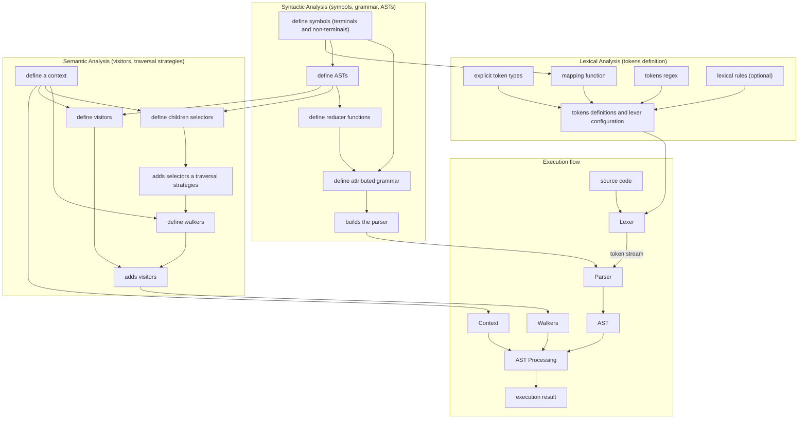

# Step 4: The **REPL**

We've built all the pieces, the lexer, the parser, the AST nodes, the semantic error collectors, and the evaluator visitors. Now it's time to connect into a cohesive, interactive experience: the **REPL** (Read-Eval-Print-Loop).

The REPL is the face of our interpreter. It reades user input, processes it through our pipeline, and displays the result, or any errors that occurred along the way. Let's walk through the implementation.

File: `main.py`

```python
from arithmetic_interpreter.grammar import parser
from arithmetic_interpreter.lexer import lexer
from arithmetic_interpreter.semantic import context,evaluator_ast_walker,error_collector_ast_walker

while True:
    context.clear_garbage()
    parser.reset()
    lexer.clear_errors()
    
    text = input('>>> ')
    if text.strip() == '':
        continue
    lexer.load_text(text)
    ast = parser.parse(lexer.tokens)
    errors = list(lexer.errors) + parser.errors
    if not errors:
        error_collector_ast_walker.walk(ast)
    errors += context.errors
    if not errors:
        evaluator_ast_walker.walk(ast)

    errors += context.errors
    errors = list(set(errors))
    if errors:
        for error in errors:
            print(error)
    else:
        result = context.get_ast_value(ast) # type: ignore
        if result is not None:
            print(result)
```

## Breaking Down the Loop

> ### 1 Preparation (Cleaning the State)

Before each iteration, we reset the state:

 - `context.clear_garbage()`: clears temporary values from the context while preserving variable definitions across REPL sessions (so `x = 10` persists).
 - `parser.reset()`: resets the parser's internal state, ensuring it's ready for fresh input.
 - `lexer.clear_errors()`: clears any leftover lexical errors from the previous input.

This ensures that each evaluation starts with a clean environment, free from residual state.

> ### 2 Reading input

```python
# ...
text = input('>>> ')
if text.strip() == '':
    continue
# ...
```

The REPL prompts the user with `>>>` and reads a line. If the user just presses **Enter** and the input does not contain any data (empty input), we skip to the next iteration, no need to process nothing.

> ### 3 Lexical and Sintatic Analysis

```python
# ...
lexer.load_text(text)
ast = parser.parse(lexer.tokens)
# ...
```

The input is fed into the lexer, which produces a stream of tokens. The parser then consumes these tokens and, if valid, returns an AST.

> ### 4 Error Collection (first pass)

```python
# ...
errors = list(lexer.errors) + parser.errors
if not errors:
    error_collector_ast_walker.walk(ast)
errors += context.errors
# ...
```

We start by collecting any errors that occurred during lexical or syntactic analysis. If none are found, we proceed to the semantic error collection pass. This walk the AST and looks for static issues like undeclared variables or literal division by zero. We add any semantic errors collected to our error list.

> ### 5 Evaluation (second pass)

```python
# ...
if not errors:
    evaluator_ast_walker.walk(ast)
# ...
```

If everything is clean, we run the evaluator pass, which computes values and stores them in the context.

> ### 6 Reporting results

```python
# ...
errors += context.errors
    errors = list(set(errors))
    if errors:
        for error in errors:
            print(error)
    else:
        result = context.get_ast_value(ast) # type: ignore
        if result is not None:
            print(result)
```

After evaluation, we check for any runtime errors that may have occurred (like division by zero). We use `set(errors)` to remove duplicates, which can happen if the same error is reported multiple times.

If there are errors, we print each one. Otherwise, we retrieve the final value from the context and display it, but only if it's not `None` (which would be the case for `exit()` or `clear()` commands).

## The Workflow in Action

Let's trace through a few examples.

### Simple expression

```bash
>>> 3 + 5 * 2
```

`1` - Lexer produces tokens: `3`, `+`, `5`, `*`, `2`.

`2` - Parser builds an AST: `Plus(3, Mul(5, 2))`.

`3` - Error collector finds no issues.

`4` - Evaluator computes `5 * 2 = 10`, then `3 + 10 = 13`.

`5` - `13` is printed.

### Variable assignment

```bash
>>> x = 10
```

`1` - Lexer produces tokens: `x`, `=`, `10`.

`2` - Parser builds an AST: `Assignment(VarAST('x'), 10)`.

`3` - Error collector checks that `x` isn't used before declaration (it isn't).

`4` - Evaluator stores `10` in the context under the name `x`.

`5` - No result is printed (assignment statements don't produce a value).

### Using a variable

```bash
>>> x * 2
```

`1` - Lexer produces tokens: `x`, `*`, `2`.

`2` - Parser builds an AST: `Mul(VarAST('x'), 2)`.

`3` - Error collector verifies that `x` is declared (it is).

`4` - Evaluator retrieves `x = 10`, computes `10 * 2 = 20`.

`5` - `20` is printed.

### Lexical and Syntax error

```bash
001 + )
```

`1` - Lexer produces tokens: `001`, `+`, `)`.

`2` - A `LexicalError` is detected at token `001`.

`3` - A `SyntaxError` is detected at token `)`.

`4` - Evaluation is aborted.

`5` - The errors are printed:

```bash
LEXICAL ERROR at line 1, column 1: number must be 0 or star with a non-zero digit
SYNTAX ERROR at line 1, column 7: Unexpected symbol ")"; expected {number, variable, (}
```

### Semantic error

```bash
>>> y + 5
```

`1` - Lexer and parser succeed.

`2` - Error collector visits `VarAST('y')` and finds that `y` hasn't been declared.

`3` - A semantic error is added to the context.

`4` - Evaluation is skipped.

`5` - The error message is printed: `SEMANTIC ERROR at line 1, column 1: undeclared variable "y"`.

### Runtime error

```bash
10 / (5 - 5)
```

`1` - Lexer and parser succeed.

`2` - Error collector checks if the right operand is a literal zero. Since it is not, it continue to evaluation.

`3` - Evaluation is detects a division by zero.

`4` - The error message is printed: `RUNTIME ERROR: division by zero not allowed at line 1, column 4`

## Why this design?

The separation of the pipeline into multiple passes (lexical, syntactic, semantic, and evaluation) offers several benefits:

 - **Clarity**: Each stage has a single responsability, making the code easier to understand and maintain.
 - **Early error detection**: Semantic errors are caught before evaluation, preventing partial computations and providing more accurate error messages.
 - **Flexibility**: You can easily add new passes (like optimization or type inference) without disrupting existing ones.

The REPL loop is the orchestrator that brings all these stages together, providing smooth, interactive experience for the user.

## What we've built

Let's take a moment to appreciate the full picture:

 - **Lexer**: Converts raw text into a stream of tokens with custom validation rules.

 - **Parser**: Uses an **LALR(1)** grammar to produce an AST with attached reductors.

 - **AST**: A clean, hierarchical representation of the program.

 - **Semantic Error Collectors**: Static checks that catch issues early.

 - **Evaluator Visitors**: Dynamic computation that produces runtime values.

 - **Context**: A shared environment that manages variables, values, and errors.

 - **REPL**: An interactive loop that ties everything together.

You've built a working interpreter for a small but expressive arithmetic language. It supports variables, operator precedence, parentheses, and built-in commands, all with robust error handling.

## System Overview (Connecting the Dots)

Before we wrap up, let's take a step back and visualize the entire architecture we've built. Understanding how each component interacts with the others is crucial for maintaining, extending, and debugging your interpreter.

The diagram below illustrates the complete pipeline, from raw source code to executed result, along with the three core configuration stages that define how our language behaves.



## Understanding the flow

> ### The configuration stages (top)

The three subgraphs at the top represent the definition phase, where we configure our language before any code is executed:

 - **Lexical Analysis State**: Here we define how the lexer behaves. Token types, regular expressions, validation rules, and the crucial mapping function that connects tokens to grammar symbols are all configured here. This stage determines what characters and patterns the lexer recognizes.

 - **Syntax Analysis State**: This is where we define the grammar of our language. We declare terminal and non-terminal symbols, write the production rules, attach reductor functions to build AST nodes, and finally build the parser from this attributed grammar.

 - **Semantic Analysis State**: Here we define how the AST will be processed. We create visitors for semantic checking and evaluation, define traversal strategies, and configure children selectors to control how the walker navigates the tree. The context, which holds all runtime state, is also defined here.

> ### The execution pipeline (bottom)

The execution flow shows the runtime behavior of our interpreter:

 - `1`: Raw code enters the system.

 - `2`: The Lexer consumes the raw text and produces a stream of tokens.

 - `3`: The Parser consumes the token stream and, if valid, produces an AST.

 - `4`: The Walkers (both error collector and evaluator) process the AST, using the Context to store and retrieve values.

 - `5`: The AST processing phase applies the visitors, resulting in either computed values or error messages.

 - `6`: Finally, the Code execution result is displayed to the user.

> ### The connections that matter

Notice the arrows connecting the configuration stages to the execution flow:

 - **Lexical Analysis -> Execution**: The lexer's behavior is defined by the token configuration.

 - **Syntax Analysis -> Execution**: The parser is built from the grammar, and the AST structure is defined here.

 - **Semantic Analysis -> Execution**: The walkers and context drive the actual evaluation.

Additionally, notice how:

 - The symbols defined in syntax analysis are used by the mapping function in lexical analysis—this is the bridge between lexer tokens and grammar symbols.

 - The AST definitions inform both the children selectors and the visitors, ensuring they understand the structure of the tree they're traversing.

> ### Why this architecture works

This separation of concerns is what makes our interpreter both robust and extensible:

 - **Configuration versus Execution**: The top three stages are about definition; the bottom is about runtime. This distinction makes it easy to modify the language without touching the execution logic.

 - **Modularity**: Each stage can be changed independently. Want to add a new token type? Modify the lexer configuration. Want to support a new operator? Update the grammar and add a new visitor.

> ### What this diagram tells you

If you ever get lost extending the interpreter, come back to this diagram. It will show you:

 - Where to add new token definitions.

 - Where to add new grammar rules.

 - Where to implement new AST nodes.

 - Where to add new semantic checks or evaluation logic.

 - How data flows from input to output.

This mental model is invaluable as you grow your language from a simple arithmetic REPL into something much more powerful.

!!! note "Sources"
    The source code of the entire tutorial can be found on the [github repository](https://github.com/YonyUk/pylgen/tree/master/examples/arithmetic_interpreter)

    [download source code<br>(arithmetic_interpreter)](https://download-directory.github.io/?url=https://github.com/YonyUk/pylgen/tree/master/examples/arithmetic_interpreter){ .md-button .md-button--primary }

## Next steps

With the foundation firmly in place, you have a solid platform to expand upon. Here are some ideas for taking it further:

 - **Add more data types**: Support `strings`, `booleans`, or `lists`.

 - **Implement functions**: Define and call user-defined functions.

 - **Add control flow**: Introduce `if`, `while`, or `for` statements.

 - **Enhance the REPL**: Add `history`, `tab completion`, or `multi-line` input.

 - **Compile to bytecode**: Instead of interpreting the AST directly, compile it to a virtual machine.

The beauty of this architecture is that it's designed to grow with you. Each new feature can be added by extending the grammar, adding new AST nodes, and implementing new visitors, all without rewriting the core infrastructure.

Congratulations on building your first interpreter with PyLGEN! You've gained hands-on experience with every stage of the compiler pipeline and seen how a well-designed framework can make language implementation both approachable and powerful. The skills you've developed here are directly applicable to building real-world languages, domain-specific languages, or even just prototyping new language ideas.

Now go ahead, experiment, break things, and build something amazing!

