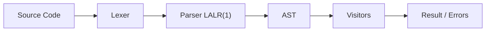

# PyLGEN


[](https://github.com/YonyUk/pylgen/actions/workflows/ci.yml?cache=1)


*From prototype to production: a **Python-native compiler framework** that brings the "**Dragon Book**" to life in Python, with clarity throughout.*

PyLGEN gives you **complete control** over every stage of language processing. Build interpreters and compilers from scratch without leaving the Python ecosystem. Prototype rapidly in pure Python, then compile to native speed with Cython for production workloads.


> [!note]
> **Cython compilation** requires a **C** compiler installed on your system to compile the code

## Why PyLGEN?

 - **Full pipeline control**: You own every step: lexer, parser, AST, semantic analysis, and evaluation.

 - **Dual‑nature design**: Pure Python for development and debugging; Cython for near‑C performance.

 - **Handles large inputs**: 2‑million‑line files parsed in ~61.62 s, about 1.89x faster than Lark + `lark_cython`.

 - **Python ecosystem integration**: Leverage NumPy, SciPy, or any library from within your language.

## 📊 Benchmark at a Glance

| | **Lark + `lark_cython`** | **PyLGEN** |
| :---: | :---: | :---: |
| **Parsing (2M lines, 40 MB)** | 116.73 s | 61.62 s |
| **AST Construction** | Separate pass | Integrated |
| **Full Interpreter** | — | ~67.52 s (incl. semantic checks + eval) |
| **Peak Memory** | ~4 GB | ~968 MB |

[more details in the benchmark section of documentation →](https://pylgen.readthedocs.io/en/latest/benchmark/benchmark-conclusion)

> PyLGEN is a framework for **building interpreters**, covering the **full compilation pipeline** from lexical analysis to execution.

## 🚀 Minimal Example

```python
from pylgen.lexer import Lexer
from pylgen.grammar import AttributedGrammar
from pylgen.parser import ParserBuilder, ParserType
from pylgen.common.enums import TokenType
from pylgen.common.types import Symbol

class TokenTypeEnum(TokenType):
    NUMBER = 'NUMBER'
    PLUS = 'PLUS'

    # ...

def mapping_function(t:TokenTypeEnum,tx:str) -> Symbol:
    # ....

# 1. Define tokens & lexer
lexer = Lexer(mapping_function, r'\s+')
lexer[0, TokenTypeEnum.NUMBER] = r'\d+'
lexer[1, TokenTypeEnum.PLUS]   = r'\+'

# 2. Define grammar with AST builders
# Assumes the following are already defined:
#   E, T, plus, binary_reductor, single_reductor
G = AttributedGrammar(Symbol('E'))
G[E] += (E, plus, T), binary_reductor
G[E] += (T,),        single_reductor

# 3. Build the parser
parser = ParserBuilder.build_parser_from_attributed(G, ParserType.LALR1)

# 4. Parse, analyse, execute
text = '1 + 2' # your text to parse
lexer.load_text(text)
ast = parser.parse(lexer.tokens)
# ... your semantic visitors & evaluator ...
```

## 🧩 Architecture



| **`Module`** | **Purpose** |
| :---: | :---: |
| **`common`** | Core types: `Symbol`, `AST`, `Token`, `ASTListView`, and error hierarchy |
| **`automaton`** | Finite automata(`DFA`/`NFA`), determinization, **Hopcroft minimization** |
| **`regex`** | **Full regex engine** -> **automata conversion** |
| **`lexer`** | **Regex‑based tokenization** with priority and validation |
| **`grammar`** | **CFG and attributed grammar** with reducers |
| **`parser`** | **LALR(1) parser generation** and runtime |
| **`analysis`** | **Visitor pattern**, **traversal strategies**, **context management** |
| **`visual`** | Interactive **HTML visualization** of ASTs, parse trees, automata and parsing tables |

> **All modules are fully usable from Python and Cython**, prototype in Python, ship in C.

# ⚡ Quick Start

```bash
pip install pylgen-core
```

Then build your interpreter step by step, following the complete tutorial in the [documentation](https://pylgen.readthedocs.io/en/latest/section-1/example-1-first-approach/).

## 📖 Learn More

 - **Step‑by‑step tutorial**: Build a **full arithmetic REPL** from scratch.

 - **VecLang case study**: Production‑grade language with vectors, functions, and slicing.

 - **Deep‑dive API tour**: Understand every module inside out.

 - **Under the hood**: Build a lexer and parser from scratch, using the same building blocks that the framework uses internally.

 - **Examples**: See practical examples of using PyLGEN to build interpreters and DSLs.

[Read the full documentation →](https://pylgen.readthedocs.io/en/latest)

**PyLGEN**: Where compiler theory meets Python pragmatism.

## Contributing

Contributions are welcome. Please open an issue or submit a pull request.

## License

This project is licensed under the **BSD 3-Clause** License. See [LICENSE](LICENSE) for details.

# Changelog

All notable changes to this project are documented in this file.

The format is based on [Keep a Changelog](https://keepachangelog.com/),
and this project adheres to [Semantic Versioning](https://semver.org/).

## [Unreleased]

## [0.7.0] - 2026-09-26

### Changed

- `AST` now exposes `start_position` and `end_position` properties instead of separate `line` and `column`. The constructor now receives `start_line`, `start_column`, `end_line`, and `end_column` instead of just `line` and `column`. **Breaking change** for any subclass of `AST` or any reductor that instantiates AST nodes.

- Moved `ErrorType` from `pylgen.analysis.error_type` to `pylgen.common.enums`. Update your imports accordingly. **Breaking change**.

- Moved `Error`, `LexicalError`, `SyntaxError`, `SemanticError` and `RuntimeError` from `pylgen.analysis.error` to `pylgen.common.types`. Update your imports accordingly. **Breaking change**.

## [0.6.2] - 2026-08-29

### Fixed

- Fixed type mismatches in `BottomUpParser` with the enum `BottomUpParserAction`.