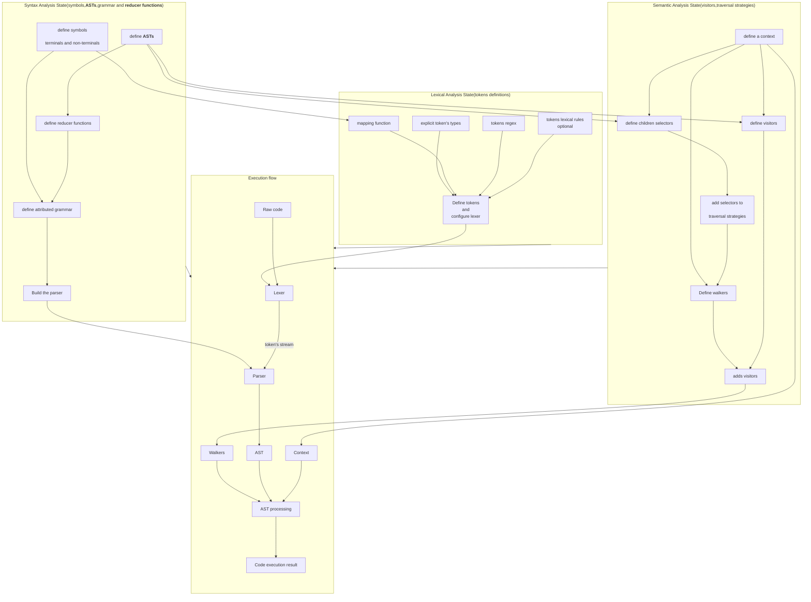

# PyLGEN


*From prototype to production: a **Python-native compiler framework** that brings the "**Dragon Book**" to life in Python, with clarity throughout.*

 - Build **interpreters** and **compilers** from scratch, without leaving the **Python's ecosystem**
 - Keep total control of what's going on at every step
 - Build **fast and easy** with python for prototyping and debugging
 - Compile and get more speed with cython

> [!note]
> **Cython compilation** requires a **C** compiler installed on system to compile the code

> ## Summary
 - [:rocket: Fast Installation](#-fast-installation)
 - [:book: Minimal example](#-minimal-example)
 - [Architecture](#-architecture)


> ## :rocket: Fast Installation

### :package: Fast installation with pip

***PyLGEN*** is a python library, so can be installed via ***pip install*** command

```bash
pip install pylgen
```

### Install from source code

 - Download the source code.
 - Install all build's dependencies.
```bash
pip install -r requirements.txt
```
 - In the root folder, run this command for a local installation
```bash
python setup.py build_ext --inplace
```

> ## :book: Minimal example

To build an **interpreter** or **compiler** from scratch with `pylgen`, the recomendation is to follow this roadmap:



Let's see an example for an arithmetic language **REPL** with support for variables definition. Let's assume this filesystem hierarchy:

    arithmetic_interpreter
        |--- asts.py
        |--- context.py
        |--- errors.py
        |--- grammar_symbols.py
        |--- grammar.py
        |--- lexer.py
        |--- reductors.py
        |--- semantic.py
        |--- visitors.py
    main.py

> ### **`State 1(Lexical analysis)`**: Build the lexer
```python
# file: lexer.py
from typing import Iterable

from pylgen.automaton import DFA
from pylgen.lexer.lexer import Lexer
from pylgen.common.types import Symbol,Token
from pylgen.common.enums import TokenType
from pylgen.analysis.lexical import LexicalRule
from .grammar_symbols import END_SYMBOL
from .grammar_symbols import (
    number,
    variable
)

class TokenTypeEnum(TokenType):
    NUMBER = 'NUMBER'
    SYMBOL = 'SYMBOL'
    OPERATOR = 'OPERATOR'
    VARIABLE = 'VARIABLE'
    KEYWORD = 'KEYWORD'

class NumberLexicRule(LexicalRule):

    def __init__(self) -> None:
        super().__init__('number must be 0 or star with a non-zero digit')
    
    def _check(self, text: str):
        if '.' in text:
            return str(float(text)) == text
        return str(int(text)) == text

class VariableLexicRule(LexicalRule):

    def __init__(self) -> None:
        super().__init__('variables names can\'t star with a number')
    
    def _check(self, text: str):
        return not text[0].isdigit()

def get_symbol_function(t:TokenTypeEnum,tx:str) -> Symbol:
    if t == TokenTypeEnum.NUMBER:
        return number
    if t == TokenTypeEnum.SYMBOL:
        return Symbol(tx,True)
    if t == TokenTypeEnum.VARIABLE:
        return variable
    if t == TokenTypeEnum.KEYWORD:
        return Symbol(tx,True)
    return Symbol(tx,True)

ignore_dfa = DFA('start','start',{' ','\n','\t'},True)
ignore_dfa += ignore_dfa.start_state,' ',ignore_dfa.start_state
ignore_dfa += ignore_dfa.start_state,'\n',ignore_dfa.start_state
ignore_dfa += ignore_dfa.start_state,'\t',ignore_dfa.start_state

lexer = Lexer(get_symbol_function,ignore_dfa)
lexer.set_eof_token(END_SYMBOL,TokenTypeEnum.SYMBOL)
lexer[0,TokenTypeEnum.NUMBER] = '\\d+|\\d+\\.\\d+'
lexer[1,TokenTypeEnum.SYMBOL] = '\\(|\\)'
lexer[2,TokenTypeEnum.OPERATOR] = '\\+|\\*\\*?|\\-|/|%|='
lexer[3,TokenTypeEnum.KEYWORD] = 'exit|clear'
lexer[4,TokenTypeEnum.VARIABLE] = '\\w+'

lexer.add_rule(TokenTypeEnum.NUMBER,NumberLexicRule())
lexer.add_rule(TokenTypeEnum.VARIABLE,VariableLexicRule())
```

> ### **State 2(Syntax analysis)**:
 - `Define symbols`:
```python
# file: grammar_symbols.py
from pylgen.common.types import Symbol

END_SYMBOL = '$'

ArithmeticExpression = Symbol('ArithmeticExpression')
E = Symbol('E')
T = Symbol('T')
F = Symbol('F')
P = Symbol('P')
VAR = Symbol('VAR')

plus = Symbol('+',True)
minus = Symbol('-',True)
mod = Symbol('%',True)
mul = Symbol('*',True)
div = Symbol('/',True)
exp = Symbol('**',True)
number = Symbol('number',True)
lp = Symbol('(',True)
rp = Symbol(')',True)
eq = Symbol('=',True)
variable = Symbol('variable',True)
exit = Symbol('exit',True)
clear = Symbol('clear',True)
```
 - `Define ASTs`:
```python
# file: asts.py
from typing import List

from pylgen.common.types import AST,Symbol
from .grammar_symbols import (
    clear,
    plus,
    minus,
    mul,
    mod,
    div,
    exp,
    eq,
    variable,
    exit
)

class BinaryAST(AST):

    def __init__(self, left:AST,right:AST,symbol: Symbol, line: int, column: int):
        super().__init__(symbol, line, column)
        self._left:AST = left
        self._right:AST = right

    @property
    def left(self) -> AST:
        return self._left # type:ignore
    
    @property
    def right(self) -> AST:
        return self._right # type: ignore
    
    def children(self) -> List[AST]:
        return [self._left,self._right]

class PlusAST(BinaryAST):

    def __init__(self, left:AST,right:AST, line: int, column: int):
        super().__init__(left,right,plus, line, column)

class MinusAST(BinaryAST):
    
    def __init__(self, left:AST,right:AST, line: int, column: int):
        super().__init__(left,right,minus, line, column)

class ModAST(BinaryAST):

    def __init__(self, left:AST,right:AST, line: int, column: int):
        super().__init__(left,right,mod, line, column)

class MulAST(BinaryAST):

    def __init__(self, left:AST,right:AST, line: int, column: int):
        super().__init__(left,right,mul, line, column)

class DivAST(BinaryAST):

    def __init__(self, left:AST,right:AST, line: int, column: int):
        super().__init__(left,right,div, line, column)

class ExpAST(BinaryAST):

    def __init__(self, left:AST,right:AST, line: int, column: int):
        super().__init__(left,right,exp, line, column)

class AssigmentAST(BinaryAST):

    def __init__(self, left: AST, right: AST, line: int, column: int):
        super().__init__(left, right, eq, line, column)

    def children(self) -> List[AST]:
        return [self._right]

class VarAST(AST):

    def __init__(self,name:str,line:int,column:int):
        super().__init__(variable,line,column)
        self._name = name
    
    @property
    def name(self) -> str:
        return self._name
    
    def children(self) -> List[AST]:
        return []

class ExitAST(AST):

    def __init__(self,line: int, column: int):
        super().__init__(exit, line, column)
    
    def children(self) -> List[AST]:
        return []

class ClearAST(AST):

    def __init__(self, line: int, column: int):
        super().__init__(clear, line, column)
    
    def children(self) -> List[AST]:
        return []
```

> [!important]
The order in which children are returned by `children()` method is the order in which traversals will get the childs for the current node.

 - `Define reductors`:
```python
# file: reductors.py
from typing import List

from pylgen.common.types import AST,ASTListView
from .grammar_symbols import (
    minus,
    plus,
    mul,
    div,
    exp,
    mod,
    eq
)
from .asts import (
    ClearAST,
    PlusAST,
    MinusAST,
    MulAST,
    DivAST,
    ExpAST,
    ModAST,
    VarAST,
    AssigmentAST,
    ExitAST
)

def binary_reductor(asts:ASTListView) -> AST:
    ast_type:type = None  # type: ignore
    if asts[1].symbol == plus:
        ast_type = PlusAST
    if asts[1].symbol == minus:
        ast_type = MinusAST
    if asts[1].symbol == mul:
        ast_type = MulAST
    if asts[1].symbol == div:
        ast_type = DivAST
    if asts[1].symbol == exp:
        ast_type = ExpAST
    if asts[1].symbol == mod:
        ast_type = ModAST
    if asts[1].symbol == eq:
        ast_type = AssigmentAST
    return ast_type(asts[0],asts[2],asts[1].line,asts[1].column)

def single_reductor(asts:ASTListView) -> AST:
    return asts[0]

def parenthesis_reductor(asts:ASTListView) -> AST:
    return asts[1]

def variable_reductor(asts:ASTListView) -> AST:
    return VarAST(asts[0].text,asts[0].line,asts[0].column) # type: ignore

def exit_reductor(asts:ASTListView) -> AST:
    return ExitAST(asts[0].line,asts[0].column)

def clear_reductor(asts:ASTListView) -> AST:
    return ClearAST(asts[0].line,asts[0].column)
```

 - `Define the grammar and build the parser`:
```python
# file: grammar.py
from pylgen.parser.parser import BottomUpParser
from pylgen.parser.parser_builder import ParserBuilder
from pylgen.parser.parser_type import ParserType
from pylgen.grammar.grammar import AttributedGrammar
from .grammar_symbols import (
    END_SYMBOL,
    VAR,
    ArithmeticExpression,
    E,
    T,
    F,
    P,
    plus,
    minus,
    mul,
    div,
    exp,
    mod,
    lp,
    rp,
    number,
    variable,
    eq,
    exit,
    clear
)
from .reductors import (
    binary_reductor,
    single_reductor,
    parenthesis_reductor,
    variable_reductor,
    exit_reductor,
    clear_reductor
)

G3 = AttributedGrammar(ArithmeticExpression,END_SYMBOL)

G3[ArithmeticExpression] += (E,),single_reductor
G3[ArithmeticExpression] += (VAR,eq,E),binary_reductor
G3[ArithmeticExpression] += (exit,lp,rp),exit_reductor
G3[ArithmeticExpression] += (clear,lp,rp),clear_reductor

G3[E] += (E,plus,T),binary_reductor
G3[E] += (E,minus,T),binary_reductor
G3[E] += (T,),single_reductor


G3[T] += (T,mul,F),binary_reductor
G3[T] += (T,div,F),binary_reductor
G3[T] += (T,mod,F),binary_reductor
G3[T] += (F,),single_reductor

G3[F] += (F,exp,P),binary_reductor
G3[F] += (P,),single_reductor

G3[P] += (lp,E,rp),parenthesis_reductor
G3[P] += (number,),single_reductor
G3[P] += (VAR,),single_reductor

G3[VAR] += (variable,),variable_reductor

parser:BottomUpParser = ParserBuilder.build_parser_from_attributed(G3,ParserType.LALR1)
```

> ### **State 3(Semantic analysis)**:

 - `Define errors`
```python
# file: errors.py
from typing import List
from pylgen.analysis.error import RuntimeError

class DivisionByZeroError(RuntimeError):

    def __init__(self, stack_trace: List[str], line: int, column: int) -> None:
        super().__init__(stack_trace, line, column, 'division by zero not allowed')

class ModuleByZeroError(RuntimeError):
    
    def __init__(self, stack_trace: List[str], line: int, column: int) -> None:
        super().__init__(stack_trace, line, column, 'module by zero not allowed')

class ModuleByNotIntegereError(RuntimeError):

    def __init__(self, stack_trace: List[str], line: int, column: int) -> None:
        super().__init__(stack_trace, line, column, 'module by a not-integer not allowed')

class ModuleWithComplexNumberError(RuntimeError):

    def __init__(self, stack_trace: List[str], line: int, column: int) -> None:
        super().__init__(stack_trace, line, column, 'module operation not supported for complex numbers')
```

 - `Define the context`
```python
# file: context.py
from typing import Any, Dict, List

from pylgen.common.types import AST
from pylgen.analysis.context import Context
from pylgen.analysis.error import RuntimeError

from .asts import VarAST

class ArithmeticExpressionContext(Context):

    def __init__(self) -> None:
        super().__init__()
        self._variables:Dict[str,Any] = {}
        self._values:Dict[AST,Any] = {}

    def reset(self) -> None:
        super().reset()
        self._variables.clear()
        self._values.clear()
    
    def clear_garbage(self) -> None:
        super().clear_errors()
        self._values.clear()

    def define_variable(self,var_name:str):
        self._variables[var_name] = None
    
    def check_variable_in_context(self,var_name:str) -> bool:
        return var_name in self._variables

    def add_runtime_error(self, ast: AST, error: RuntimeError) -> None:
        self._values[ast] = error

    def clear_runtime_errors(self) -> None:
        pass

    def get_runtime_errors(self) -> List[RuntimeError]:
        return [value for value in self._values.values() if isinstance(value,RuntimeError)]

    def add_variable(self,name:str,value:Any) -> None:
        self._variables[name] = value
    
    def exists_variable(self,name:str) -> bool:
        return name in self._variables
    
    def get_variable_value(self,name:str) -> Any:
        return self._variables[name]
    
    def add_ast_value(self,ast:AST,value:Any) -> None:
        self._values[ast] = value
    
    def get_ast_value(self,ast:AST) -> Any:
        if isinstance(ast,VarAST):
            return self._variables[ast.name]
        return self._values.get(ast,None)
```

 - `Define visitors and traversal strategies`:
```python
# file: visitors.py
from typing import Any,List
import sys
import os

from pylgen.analysis.context import Context
from pylgen.common.types import AST,Token
from pylgen.analysis.visitor import ASTChildrenSelector,ASTVisitor,TraversalStrategy
from pylgen.analysis.error import RuntimeError,SemanticError
from .context import ArithmeticExpressionContext
from .asts import BinaryAST,VarAST
from .errors import (
    DivisionByZeroError,
    ModuleByZeroError,
    ModuleByNotIntegereError,
    ModuleWithComplexNumberError
)

class ArithmeticExpressionASTChildrenSelector(ASTChildrenSelector):

    def __init__(self) -> None:
        super().__init__(ArithmeticExpressionContext)
    
    def select_children(self, ast: AST, context: ArithmeticExpressionContext) -> List[AST]: # type: ignore
        self._check_context_type(context)
        return ast.children()

class BinaryASTEvaluatorVisitor(ASTVisitor):
    _left_type:type
    _right_type:type
    _left_value:Any
    _right_value:Any
    _runtime_error = False

    def __init__(self) -> None:
        super().__init__(ArithmeticExpressionContext)
    
    def visit(self, ast: BinaryAST, context: ArithmeticExpressionContext) -> None: # type: ignore
        self._check_context_type(context)
        self._runtime_error = False
        self._left_type = type(context.get_ast_value(ast.left))
        self._left_value = context.get_ast_value(ast.left)
        self._right_type = type(context.get_ast_value(ast.right))
        self._right_value = context.get_ast_value(ast.right)
        
        if isinstance(self._left_value,RuntimeError):
            context.add_runtime_error(ast,self._left_value)
            self._runtime_error = True
        if isinstance(self._right_value,RuntimeError):
            context.add_runtime_error(ast,self._right_value)
            self._runtime_error = True

class PlusASTEvaluatorVisitor(BinaryASTEvaluatorVisitor):

    def visit(self, ast: BinaryAST, context: ArithmeticExpressionContext) -> None:
        super().visit(ast,context)
        if not self._runtime_error:
            context.add_ast_value(ast,self._left_value + self._right_value)

class MinusASTEvaluatorVisitor(BinaryASTEvaluatorVisitor):

    def visit(self, ast: BinaryAST, context: ArithmeticExpressionContext) -> None:
        super().visit(ast,context)
        if not self._runtime_error:
            context.add_ast_value(ast,self._left_value - self._right_value)

class MulASTEvaluatorVisitor(BinaryASTEvaluatorVisitor):

    def visit(self, ast: BinaryAST, context: ArithmeticExpressionContext) -> None:
        super().visit(ast,context)
        if not self._runtime_error:
            context.add_ast_value(ast,self._left_value * self._right_value)

class DivASTEvaluatorVisitor(BinaryASTEvaluatorVisitor):

    def visit(self, ast: BinaryAST, context: ArithmeticExpressionContext) -> None:
        super().visit(ast,context)
        if self._runtime_error:
            return
        if self._right_value == 0:
            context.add_runtime_error(ast,DivisionByZeroError(context.stack_trace,ast.line,ast.column))
        else:
            context.add_ast_value(ast,self._left_value / self._right_value)

class ExpASTEvaluatorVisitor(BinaryASTEvaluatorVisitor):

    def visit(self, ast: BinaryAST, context: ArithmeticExpressionContext) -> None:
        super().visit(ast,context)
        if not self._runtime_error:
            context.add_ast_value(ast,self._left_value ** self._right_value)

class ModASTEvaluatorVisitor(BinaryASTEvaluatorVisitor):

    def visit(self, ast: BinaryAST, context: ArithmeticExpressionContext) -> None:
        super().visit(ast,context)
        if self._runtime_error:
            return
        if self._right_value == 0:
            context.add_runtime_error(ast,ModuleByZeroError(context.stack_trace,ast.line,ast.column))
        elif self._right_type == complex or self._left_type == complex:
            context.add_runtime_error(ast,ModuleWithComplexNumberError(context.stack_trace,ast.line,ast.column))
        elif self._right_type != int:
            context.add_runtime_error(ast,ModuleByNotIntegereError(context.stack_trace,ast.line,ast.column))
        else:
            context.add_ast_value(ast,self._left_value % self._right_value)

class AssigmentASTEvaluatorVisitor(BinaryASTEvaluatorVisitor):

    def visit(self, ast: BinaryAST, context: ArithmeticExpressionContext) -> None:
        self._check_context_type(context)
        self._right_value = context.get_ast_value(ast.right)
        if isinstance(self._right_value,RuntimeError):
            context.add_runtime_error(ast,self._right_value)
            return
        context.add_variable(ast.left.name,self._right_value) # type: ignore

class AtomicASTEvaluatorVisitor(ASTVisitor):

    def __init__(self) -> None:
        super().__init__(ArithmeticExpressionContext)
    
    def visit(self, ast: AST, context: ArithmeticExpressionContext) -> None: # type: ignore
        self._check_context_type(context)
        if '.' in ast.text: # type: ignore
            context.add_ast_value(ast,float(ast.text)) # type: ignore
        else:
            context.add_ast_value(ast,int(ast.text)) # type: ignore

class ExitASTEvaluatorVisitor(ASTVisitor):

    def __init__(self) -> None:
        super().__init__(ArithmeticExpressionContext)
    
    def visit(self, ast: AST, context: ArithmeticExpressionContext) -> None: # type: ignore
        self._check_context_type(context)
        sys.exit(0)

class ClearASTEvaluatorVisitor(ASTVisitor):

    def __init__(self) -> None:
        super().__init__(ArithmeticExpressionContext)
    
    def visit(self, ast: AST, context: ArithmeticExpressionContext) -> None: # type: ignore
        self._check_context_type(context)
        if os.sep == '\\':
            os.system('cls')
        else:
            os.system('clear')

class DivASTSemanticErrorCollectorVisitor(ASTVisitor):

    def __init__(self) -> None:
        super().__init__(ArithmeticExpressionContext)
    
    def visit(self, ast: AST, context: ArithmeticExpressionContext) -> None: # type: ignore
        self._check_context_type(context)
        if isinstance(ast.right,Token) and float(ast.right.text) == 0: # type: ignore
            error = SemanticError('division by zero not allowed',ast.line,ast.column)
            context.add_semantic_error(error)

class ModASTSemanticErrorCollectorVisitor(ASTVisitor):

    def __init__(self) -> None:
        super().__init__(ArithmeticExpressionContext)
    
    def visit(self, ast: AST, context: ArithmeticExpressionContext) -> None: # type: ignore
        self._check_context_type(context)
        if isinstance(ast.right,Token): # type: ignore
            if float(ast.right.text) == 0: # type: ignore
                error = SemanticError('module by zero not allowed',ast.line,ast.column)
                context.add_semantic_error(error)
            if int(float(ast.right.text)) != float(ast.right.text): # type: ignore
                error = SemanticError('module by not-integer not allowed',ast.line,ast.column)
                context.add_semantic_error(error)

class VariableASTSemanticErrorCollectorVisitor(ASTVisitor):

    def __init__(self) -> None:
        super().__init__(ArithmeticExpressionContext)
    
    def visit(self, ast: AST, context: ArithmeticExpressionContext) -> None: # type: ignore
        self._check_context_type(context)
        if not context.check_variable_in_context(ast.name): # type: ignore
            error = SemanticError(f'undeclared variable "{ast.name}"',ast.line,ast.column) # type: ignore
            context.add_semantic_error(error)

class AssigmentASTSemanticErrorCollectorVisitor(ASTVisitor):

    def __init__(self) -> None:
        super().__init__(ArithmeticExpressionContext)
    
    def visit(self, ast: AST, context: ArithmeticExpressionContext) -> None: # type: ignore
        self._check_context_type(context)
        if isinstance(ast.right,VarAST): # type: ignore
            if not context.check_variable_in_context(ast.right.name): # type: ignore
                error = SemanticError(f'undeclared variable "{ast.right.name}"',ast.right.line,ast.right.column) # type: ignore
                context.add_semantic_error(error)

class PostOrderStrategy(TraversalStrategy):

    def __init__(self) -> None:
        super().__init__(ArithmeticExpressionContext)
        self._stack = []
        self._seen = []
    
    def init(self, root: AST) -> None:
        super().init(root)
        self._stack.append(root)
    
    def has_next(self) -> bool:
        return len(self._stack) > 0
    
    def current(self,context:ArithmeticExpressionContext) -> AST: # type: ignore
        self._check_context_type(context)
        selector = self._get_selector(self._stack[-1])
        children = selector.select_children(self._stack[-1],context)
        seen = self._stack[-1] in self._seen
        while children and not seen:
            self._seen.append(self._stack[-1])
            for child in children:
                self._stack.append(child)
            selector = self._get_selector(self._stack[-1])
            children = selector.select_children(self._stack[-1],context)
            seen = self._stack[-1] in self._seen
        return self._stack.pop()
    
    def reset(self) -> None:
        self._seen.clear()
        self._stack.clear()
```

 - `Define the semantic rules`:
```python
# file: semantic.py
from pylgen.common.types import Token
from pylgen.analysis.visitor import ASTWalker

from .context import ArithmeticExpressionContext
from .visitors import (
    ClearASTEvaluatorVisitor,
    PostOrderStrategy,
    ArithmeticExpressionASTChildrenSelector,
    DivASTSemanticErrorCollectorVisitor,
    ModASTSemanticErrorCollectorVisitor,
    VariableASTSemanticErrorCollectorVisitor,
    AssigmentASTSemanticErrorCollectorVisitor,
    PlusASTEvaluatorVisitor,
    MinusASTEvaluatorVisitor,
    MulASTEvaluatorVisitor,
    DivASTEvaluatorVisitor,
    ExpASTEvaluatorVisitor,
    ModASTEvaluatorVisitor,
    AtomicASTEvaluatorVisitor,
    AssigmentASTEvaluatorVisitor,
    ExitASTEvaluatorVisitor
)
from .asts import (
    AssigmentAST,
    ClearAST,
    PlusAST,
    MinusAST,
    MulAST,
    DivAST,
    ExpAST,
    ModAST,
    VarAST,
    ExitAST
)

context = ArithmeticExpressionContext()
traversal_strategy = PostOrderStrategy()

traversal_strategy.set_default_selector(ArithmeticExpressionASTChildrenSelector())

error_collector_ast_walker = ASTWalker(context,traversal_strategy)

error_collector_ast_walker.add_visitor(DivAST,DivASTSemanticErrorCollectorVisitor())
error_collector_ast_walker.add_visitor(ModAST,ModASTSemanticErrorCollectorVisitor())
error_collector_ast_walker.add_visitor(VarAST,VariableASTSemanticErrorCollectorVisitor())
error_collector_ast_walker.add_visitor(AssigmentAST,AssigmentASTSemanticErrorCollectorVisitor())

evaluator_ast_walker = ASTWalker(context,traversal_strategy)

evaluator_ast_walker.add_visitor(PlusAST,PlusASTEvaluatorVisitor())
evaluator_ast_walker.add_visitor(MinusAST,MinusASTEvaluatorVisitor())
evaluator_ast_walker.add_visitor(MulAST,MulASTEvaluatorVisitor())
evaluator_ast_walker.add_visitor(DivAST,DivASTEvaluatorVisitor())
evaluator_ast_walker.add_visitor(ExpAST,ExpASTEvaluatorVisitor())
evaluator_ast_walker.add_visitor(ModAST,ModASTEvaluatorVisitor())
evaluator_ast_walker.add_visitor(Token,AtomicASTEvaluatorVisitor())
evaluator_ast_walker.add_visitor(AssigmentAST,AssigmentASTEvaluatorVisitor())
evaluator_ast_walker.add_visitor(ExitAST,ExitASTEvaluatorVisitor())
evaluator_ast_walker.add_visitor(ClearAST,ClearASTEvaluatorVisitor())
```

> ### Define execution loop
```python
# file: main.py
from pylgen.parser.parser import ParsingException

from arithmetic_interpreter.grammar import parser
from arithmetic_interpreter.lexer import lexer
from arithmetic_interpreter.semantic import context,evaluator_ast_walker,error_collector_ast_walker

while True:
    context.clear_garbage()
    parser.reset()
    lexer.clear_errors()
    
    text = input('>>> ')
    if len(text) == 0:
        continue
    lexer.load_text(text)
    try:
        ast = parser.parse(lexer.tokens)
        error_collector_ast_walker.walk(ast)
        if not context.errors:
            evaluator_ast_walker.walk(ast)
    except ParsingException:
        pass

    errors = list(lexer.errors) + parser.errors + context.errors
    if errors:
        for error in errors:
            print(error)
    else:
        result = context.get_ast_value(ast) # type: ignore
        if result is not None:
            print(result)
```
> ## Architecture

***PyLGEN*** is a collection of Python modules featuring a high-performance core written in Cython. Together, they offer comprehensive tools for constructing interpreters and compilers from scratch, all while maintaining full compatibility with the broader Python ecosystem

 - [`🔎 pylgen.analysis`](#-analysis)
 - [`🧱 pylgen.common`](#-common)
 - [`🤖 pylgen.automaton`](#-automaton)
 - :books: [`pylgen.grammar`](#-grammar)
 - :books: [`pylgen.lexer`](#-lexer)
 - :books: [`pylgen.parser`](#-parser)
 - :books: [`pylgen.regex`](#-regex)
 - [`📉 pylgen.visual`](#-visual)

### 🔎 analysis

Supplies the essential foundation for **semantic analysis, validation, and execution** of languages built with ***pylgen***. It bridges the gap between raw syntax (the **AST**) and meaningfull program behaviour 

> #### Core Components
 - **`Context(abstract base class)`**: Manages global state during **AST** traversal: 
> [!important]
`push_new_scope,pop_scope,clear_runtime_errors,add_runtime_error` and `get_runtime_errors` must be implemented by users.
 - **`Error and its subclasses (LexicalError,SyntaxError,SemanticError)`**: A hierarchy for errors that occur during lexical, syntactic, and semantic analysis. All inherit from `Error`, which includes line, column, a descriptive message, and categorisation via the `ErrorType` enum.
 - **`RuntimeError`**: Represents errors that happen during program execution. It includes a stack trace to aid debugging.
 - **`LexicalRule`**: An abstraction to defining validation rules on tokens. Used in `pylgen.lexer` module to check token properties. The `check` method returns a `LexicalError` if the rule is violated, or `None` otherwise.
 - **`ASTVisitor(abstract class)`**: Defines the contract for visitors that operate on `AST` nodes. Each visitor must implement `visit(ast,context)`, where it can inspect or modify the node and the context.
 - **`ASTChildrenSelector(abstract class)`**: Specifies which children (or the node itself) should be considered during traversal, and in what order. It is used by the traversal strategy to determine the next node to visit.
 - **`TraversalStrategy(asbtract class)`**: Defines the interface for traversal strategies (e.g. depth-first, breadth-first, custom-order). Key methods: `init(root),has_next(),current(context)` and `reset()`.
> [!important]
The interface does not explicitly define where the iterator's advance mechanism should be implemented; this responsibility is left to the developer.
 - **`ASTWalker`**: Orchestrates the **AST** traversal by combining a `TraversalStrategy` with a collection of `ASTVisitor` instances associated with specific node types. During `walk(ast)`, it iterates over nodes according to the strategy and applies the corresponding visitor (or a default visitor if it was supplied and none visitor was registered for a node type).

### 🧱 common

Provides the **core data types and utilities** shared across all modules of the framework, forming the common language that ties parsing, analysis, and code generation together.

> #### Core types and utilities
 - **`Symbol`**: Represents grammar symbols (both terminals and non-terminals). It is **immutable** and **hashable**, and distinguishes between terminal, non-terminal, and epsilon symbols. Used throughout grammar definitions, parser tables, and AST nodes.
 - **`AST`**: The abstract base class for all **Abstract Syntax Tree** nodes. Every concrete AST node inherits from it and stores its symbol, source location (line and column), and must implement the `children()` method to provide access to its child nodes.
 - **`Token`**: Encapsulates a lexical token, carrying its type (`TokenType`), text, associated symbol, and precise position information. Used by the lexer and the parser to feed the syntactic analysis.
 - **`ASTListView`**: A lightweight, read-only view over a list of AST nodes. It is passed to reducer functions (semantic actions) during parsing, providing efficient indexed access (`__getitem__`) and length (`__len__`) without copying the underlying list.
 - **`Table`**: A thin wrapper around a dictionary representing transition tables (e.g., for automata or parsing). It enforces string keys and values, and provides convenient properties (`entries`, `values`, `items`) to inspect its contents.
 - **`TokenType`**: A base `StrEnum` that serves as a type-safe enumeration for all lexical token types, ensuring consistency across the lexer and parser.

> #### Examples
```python
from pylgen.common.types import Symbol,AST,Token,Table

# creates a non-terminal symbol
S = Symbol('S')
# creates a terminal symbol
t = Symbol('t',True)
# creates an epsilon symbol
epsilon = Symbol('epsilon',True,True)

# creates an ast
s_ast = AST(S,1,1)

# creates a token
# let's assume a hypothetical enum TokenTypeEnum 
token = Token('texto',TokenTypeEnum.STRING,t,1,1)

# creates a table
table = Table()
# adding values
table['a','b'] = 'c'
```

### :robot: automaton

Provides the **core finite automata infrastructure** for pattern matching, forming the bedrock of the lexer and lexical analysis pipeline. It efficiently bridges regular expressions to executable state machines.

> #### Core capabilities
 - **`Automaton Construction`**: Provides several factory methods to build DFAs and NFAs, supporting standard regular language operations out-of-the-box, including **union** ( `|` ), **concatenation** ( `.` ), **intersection** ( `&` ), and **Kleene star** ( `*` ).
 - **`Determinization and Minimization`**: Transforms NFAs to DFAs via the `to_deterministic()` method and applies **Hopcroft's algorithm** for DFA minimization (`minimize()`). This yields an extremely efficient tokenization engine, drastically reducing state count and lookup overhead.

> #### Usage

 - #### Creating a DFA explicitly

```python
from pylgen.automaton import create_dfa,State
from pylgen.common import Table

# create the states
q0 = State('q0','q0')
q1 = State('q1','q1',True)

# create the transition table
table = Table()
# q0 -- 0 --> q1
table['q0','0'] = 'q1'
# q0 -- 1 --> q0
table['q0','1'] = 'q0'
# q1 -- 0 --> q1
table['q1','0'] = 'q1'
# q1 -- 1 --> q0
table['q1','1'] = 'q0'

# create the dfa

aut = create_dfa({q0,q1},table,'q0',{'0','1'})
```

 - #### Creating a DFA incrementally
```python
from pylgen.automaton import DFA,State

aut = DFA('q0','q0',{'0','1'})

# gets the start state
q0 = aut.start_state
# creates a new state
q1 = State('q1','q1',True)

# adds transitions
aut.add_transition(q0,q1,'0')
aut.add_transition(q0,q0,'1')
aut.add_transition(q1,q1,'0')
aut.add_transition(q1,q0,'1')
```
> [!tip]
 `1` - Alternatively, this can be done this way:
```python
from pylgen.automaton import create_dfa,State
from pylgen.common import Table

q0 = State('q0','q0')
q1 = State('q1','q1',True)

# create the dfa
aut = create_dfa({q0,q1},Table(),'q0',{'0','1'})

# adds transitions
aut.add_transition(q0,q1,'0')
aut.add_transition(q0,q0,'1')
aut.add_transition(q1,q1,'0')
aut.add_transition(q1,q0,'1')
```
> [!tip]
 `2` - More easily
```python
from pylgen.automaton import create_dfa,State
from pylgen.common import Table

q0 = State('q0','q0')
q1 = State('q1','q1',True)

# create the dfa
aut = create_dfa({q0,q1},Table(),'q0',{'0','1'})

# adds transitions
aut += q0,'0',q1
aut += q0,'1',q0
aut += q1,'0',q1
aut += q1,'1',q0
```

### :books: grammar

Provides the **formal language definition framework** that underpins the entire parsing pipeline. It bridges context-free grammar (CFG) specification to executable LR parser tables, with native support for attributed productions that build Abstract Syntax Trees (ASTs) directly during parsing. It also offers basic utilities for grammar analysis and transformation.

> #### Core Components
 - **`Production`**: A rule of the form `head → sequence of symbols`. Immutable and hashable, it uniquely identifies each production.
 - **`ProductionsSet`**: A container that groups all productions sharing the same head. Supports the `+=` operator to add new productions (as tuples of symbols) and preserves insertion order.
 - **`AttributedProductionsSet`**: Extends `ProductionsSet` to associate a **reducer function** (signature `(ASTListView) -> AST`) with each production. Used internally by attributed grammars.
 - **`Grammar`**: The base class that stores the start symbol, end-of-input marker, and all productions. Provides methods for computing **`first`** and **`follow`** sets, and static methods for regularity checks (`IsLeftRegular`, `IsRightRegular`, `IsRegular`), grammar augmentation (`AugmentGrammar`), and reversal (`Reverse`).
 - **`AttributedGrammar`**: Subclass of `Grammar` that pairs each production with a reducer function ( `ASTListView -> AST` ). This is the core mechanism for constructing ASTs during parsing.

> #### Key Features
- **Intuitive API**: Define productions in a Pythonic style using the `+=` operator.

```python
# E, T, plus must be instances of Symbol

# Attributed grammar with reducers
G[E] += (E, plus, T), binary_reducer
G[E] += (T,), single_reducer

# Plain grammar (no reducers)
G[E] += E, plus, T
G[E] += T,
```

### :books: lexer

Provides a **flexible and efficient lexical analysis framework** that transforms raw source code into a stream of tokens, ready for parsing. It combines regex-based pattern matching with automata theory to deliver both correctness and performance.

> #### Core components
 - **`Lexer`**: The main class that manages token definitions, input text, and token streaming. Extends `BaseLexer` with error handling, validation rules, and regex-based token definition.
 - **`BaseLexer`**: The foundational class that handles automaton-driven scanning, with DFA-based token matching and the ability to skip ignored patterns (e.g., whitespace, comments). Typically not used directly.

> #### Key features
 - **`Regex‑Based Pattern Definition`**: Define tokens using standard regex strings, automatically compiled into efficient DFAs:
```python
# TokenTypeEnum must be a subclass of TokenType (from common.enums)
lexer[0, TokenTypeEnum.INTEGER] = r'\d+'
lexer[1, TokenTypeEnum.FLOAT]   = r'\d*\.\d+'
```

 - **`Prioritized Matching`**: Tokens are matched according to an explicit integer priority (lower numbers have higher precedence). This resolves ambiguities when multiple patterns match the same input prefix.

 - **`Validation Rules`**: Attach LexicalRule objects to token types to perform additional checks (e.g., value ranges, format constraints). Violations are collected as LexicalError objects and can be retrieved via the errors property.
```python
class IntegerLexicalRule(LexicalRule):
    # ... code ...

lexer.add_rule(TokenTypeEnum.INTEGER,IntegerLexicalRule())
```

 - **`Custom Symbol Mapping`**: A user‑provided function get_symbol_function(type: TokenType, text: str) -> Symbol maps each token to a grammar symbol, enabling tight integration with the parser.

 - **`Ignore Patterns`**: Supply a DFA for characters to skip (e.g., whitespace, comments) to filter out irrelevant input.

 - **`EOF Handling`**: Explicit end‑of‑file token with configurable type and symbol, ensuring a clean termination of the token stream.

 - **`Lazy Token Stream`**: The tokens property returns a generator that yields tokens on‑the‑fly, minimizing memory usage even for large source files.

### :books: parser

Provides a **production-ready LALR(1) parser framework that transforms** token streams into ***Abstract Syntax Trees (ASTs)*** via attributed grammar reductions. It seamlessly bridges grammar definitions and AST construction offering both performance and flexibility.

> #### Core components
 - **`Parser`**: Abstract base class defining the parsing contract, error handling, and parse tree access.
 - **`BottomUpParser`**: Concrete **BottomUpParser** implementation. Maintains separate stacks for states, symbols, and AST nodes. During each reduction, it invokes a user‑provided reductor associated with the current production, building the AST incrementally.
 - **`ParserBuilder`**: Consumes a plain `Grammar` or an `AttributedGrammar (from pylgen.grammar)` and generates the ACTION and GOTO tables. It detects **shift/reduce** and **reduce/reduce** conflicts.
 - **`ParseTreeNode`**: Optional concrete syntax tree (CST) node, built alongside the AST when debugging or visualisation is enabled. Each node corresponds to a production reduction and stores its children.

> #### Key features
 - **`LALR(1) Parsing`**: Implements the standard algorithm, handling most context‑free grammars. Conflicts are identified at build time and reported as `LALRShiftReduceConflictException` or `LALRReduceReduceConflictException`.
 - **`Error Recovery`**: Employs **panic‑mode** recovery, using synchronisation sets derived from the grammar's **FOLLOW** sets. When a syntax error occurs, the parser discards tokens until a synchronising symbol is found, allowing it to resume parsing and report multiple errors.
 - **`Interactive Support`**: The `reset()` method restores the parser to its initial state, making it suitable for **REPL environments** where multiple independent inputs are processed sequentially.
 - **`Optional Parse Tree`**: By setting the `draw‑parse‑tree flag`, the parser builds a concrete syntax tree alongside the AST, aiding debugging and tooling.
 - **`Custom Reductors`**: Reductors are functions that convert a list of child ASTs (wrapped in an `ASTListView`) into a single AST node. They can be attached to productions either via the attributed grammar or at runtime using the **__setitem__** operator.

### :books: regex

Provides a **complete regular expression engine** that serves as a bridge between textual regex patterns and **automata theory**. It offers a **unified interface for parsing, converting, and generating regular languages**, making it an essential tool for lexer construction, pattern matching, and **language analysis**.

> #### Core components
 - **`RegexEngine`**: Static facade exposing all public operations: `Parse` (string → DFA), `GetAutomaton` (grammar → DFA), `GetGrammar` (automaton → grammar), and `GetRegex` (automaton → regex). It handles the entire pipeline from source text to minimized automaton.

> #### Key features
 - **`Comprehensive Regex Syntax`**: Supports concatenation, alternation (|), repetition (*, +, ?), grouping ((...)), character classes ([...]) with ranges (a-z) and negation ([^...]), predefined constants (\d, \s, \w, .), escape sequences, and bounded quantifiers ({m,n}). The parsing result is an automata.
 - **`Bidirectional Conversion`**: Beyond parsing, the engine can:
    - Convert a regular grammar (left‑linear or right‑linear) into an equivalent DFA, enabling lexer generation from grammatical descriptions.

    - Infer a regular expression from any automaton using state elimination (Brzozowski‑style), producing a readable pattern even for complex automata. This is invaluable for debugging and reverse‑engineering.

### 📉 visual

Provides **interactive graph visualization** tools for **automata, lexers, abstract syntax trees (ASTs), and parse trees**. It leverages **pyvis** and **networkx** to generate **standalone HTML files** with **embedded resources (CSS/JS)** for offline use, making it ideal for debugging, documentation, and presentations.

> #### Key features
 - `Render automata`: Draw an interactive directed graph representing any **DFA/NFA**, with transition labels, accepting states, and ε‑transitions clearly distinguished.
 - **`Visualise Lexer DFAs`**: Convenience wrapper around `draw_automaton` to directly visualise the DFA used by a lexer.
 - `Render AST`: Display **ASTs** as hierarchical trees with node attributes (non‑private, JSON‑serializable) shown as tooltips, helping to inspect the structure and data.
 - **`Render Parse Trees`**: Show the concrete syntax tree produced by a parser, with each node labelled by the grammar symbol.
 - **`Resource Caching`**: Optionally cache external stylesheets and scripts to avoid repeated downloads, generating **self‑contained HTML files** that work offline.
 - **`Export & Share`**: All graphs are saved as single HTML files that can be opened in any modern browser, shared, or embedded.

> #### Usage

#### Setting the cache file

To enable resource caching, specify a cache file path before generating any HTML:

```python
from pylgen.visual import set_cache_file

set_cache_file('vis_cache.pkl')
```

> [!note]
If the cache file path already exists, it will be loaded and updated if necessary, otherwise a new one is created. The cache stores downloaded CSS/JS resources as a pickle dictionary.

#### Drawing an automaton

```python
from pylgen.visual import draw_automaton

# ... code to create the automaton

draw_automaton(automaton, 
               filename="my_automaton",
               show=True,
               cache=True,
               physics=False,
               select_menu=False,
               filter_menu=False,
               nodes=False,
               edges=False,
               as_tree=False)

```

#### Drawing a lexer

```python
from pylgen.visual import draw_lexer

# ... code to build the lexer

draw_lexer(lexer, 
               filename="my_automaton",
               show=True,
               cache=True,
               physics=False,
               select_menu=False,
               filter_menu=False,
               nodes=False,
               edges=False,
               as_tree=False)
```

> [!note]
This is a convenience wrapper that calls `draw_automaton(lexer.dfa,**kwargs)`. All arguments are passed through.

#### Drawing an **AST**

```python
from pylgen.visual import draw_ast

# ... code to build the ast

draw_ast(ast_root, 
         filename="ast",
         show=True,
         cache=True,
         physics=False,
         select_menu=False,
         filter_menu=False,
         nodes=False,
         edges=False)
```

> [!tip]
The resulting graph shows each AST node with its label (the symbol) and, on hover, displays all non‑private, JSON‑serializable attributes for quick inspection.

#### Drawing a **Parse Tree**

```python
from pylgen.visual import draw_parse_tree_from_parser

# ... code to build the parse tree

draw_parse_tree_from_parser(parser, 
                            filename="parse_tree",
                            show=True,
                            cache=True,
                            physics=False,
                            select_menu=False,
                            filter_menu=False,
                            nodes=False,
                            edges=False)
```

Nodes are labelled with the grammar symbol

> [!note]
`draw_parse_tree_from_parser` relies on the parser’s internal parse tree. You must call `parser.set_draw_parse_tree_flag(True)` before parsing; otherwise, the tree will be empty and the visualisation will fail.

#### API Reference

All drawing functions accept the following keword arguments:

| kwarg | type | description | `draw_automaton` | `draw_lexer` | `draw_ast` | `draw_parse_tree_from_parser` |
|:---:| :---: | :--- | :---: | :---: | :---: | :---: |
| filename | `str` | specifies the name of the HTML file generated | :white_check_mark: | :white_check_mark: | :white_check_mark:| :white_check_mark: |
| show | `bool` | specifies if the file will be opened after creating | :white_check_mark: | :white_check_mark: | :white_check_mark:| :white_check_mark: |
| cache | `bool` | specifies if the cache file will be used to generate the file | :white_check_mark: | :white_check_mark: | :white_check_mark:| :white_check_mark: |
| physics | `bool` | enables the physics options in the interactive graphics | :white_check_mark: | :white_check_mark: | :white_check_mark:| :white_check_mark: |
| select_menu | `bool` | enables selecting menu in the interactive graphics | :white_check_mark: | :white_check_mark: | :white_check_mark:| :white_check_mark: |
| filter_menu | `bool` | enables filtering menu in the interactive graphics | :white_check_mark: | :white_check_mark: | :white_check_mark:| :white_check_mark: |
| nodes | `bool` | enables nodes options, see **pyvis**'s official documentation for more information | :white_check_mark: | :white_check_mark: | :white_check_mark:| :white_check_mark: |
| edges | `bool` | enables edges options, see **pyvis**'s official documentation for more information | :white_check_mark: | :white_check_mark: | :white_check_mark:| :white_check_mark: |
| ast_tree | `bool` | displays the graph as a tree | :white_check_mark: | :white_check_mark: | :x:(default) | :x:(default) |

> [!note]
For `AST` and `parse tree` rendering, the layout is fixed to a hierarchical tree structure; the as_tree parameter is ignored. All boolean parameters default to False.