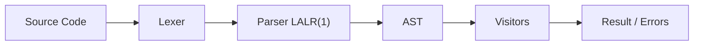

# PyLGEN


[](https://github.com/YonyUk/pylgen/actions/workflows/ci.yml)


*From prototype to production: a **Python-native compiler framework** that brings the "**Dragon Book**" to life in Python, with clarity throughout.*

PyLGEN gives you **complete control** over every stage of language processing. Build interpreters and compilers from scratch without leaving the Python ecosystem. Prototype rapidly in pure Python, then compile to native speed with Cython for production workloads.

> [!note]
> **Cython compilation** requires a **C** compiler installed on system to compile the code

## Why PyLGEN?

 - **Full pipeline control**: You own every step: lexer, parser, AST, semantic analysis, and evaluation.

 - **Dual‑nature design**: Pure Python for development and debugging; Cython for near‑C performance.

 - **Built for scale**: Handles 2‑million‑line inputs with ~2.5x faster parsing than Lark + `lark_cython`.

 - **Python ecosystem integration**: Leverage NumPy, SciPy, or any library from within your language.

## 📊 Benchmark at a Glance

| | **Lark + `lark_cython`** | **PyLGEN** |
| :---: | :---: | :---: |
| **Parsing (2M lines, 40 MB)** | 151.9 s | 61.1 s |
| **AST Construction** | Separate pass | Integrated |
| **Full Interpreter** | — | ~65 s (incl. semantic checks + eval) |
| **Peak Memory** | ~4 GB | ~887 MB |

> PyLGEN is **not just a parser**, it's a complete, production‑ready interpreter framework that outperforms industry‑standard tools.

## 🚀 Minimal Example

```python
from pylgen.lexer import Lexer
from pylgen.grammar import AttributedGrammar
from pylgen.parser import ParserBuilder, ParserType

# 1. Define tokens & lexer
lexer = Lexer(mapping_function, r'\s+')
lexer[0, 'NUMBER'] = r'\d+'
lexer[1, 'PLUS']   = r'\+'

# 2. Define grammar with AST builders
G = AttributedGrammar(start=Symbol('E'))
G[E] += (E, plus, T), binary_reductor
G[E] += (T,),        single_reductor

# 3. Build the parser
parser = ParserBuilder.build_parser_from_attributed(G, ParserType.LALR1)

# 4. Parse, analyse, execute
ast = parser.parse(lexer.tokens)
# ... your semantic visitors & evaluator ...
```

## 🧩 Architecture



| **`Module`** | **Purpose** |
| :---: | :---: |
| **`common`** | Core types: `Symbol`, `AST`, `Token`, `ASTListView` |
| **`automaton`** | Finite automata(`DFA`/`NFA`), determinization, **Hopcroft minimisation** |
| **`regex`** | **Full regex engine** -> **automata conversion** |
| **`lexer`** | **Regex‑based tokenisation** with priority and validation |
| **`grammar`** | **CFG and attributed grammar** with reducers |
| **`parser`** | **LALR(1) parser generation** and runtime |
| **`analysis`** | **Visitor pattern**, **traversal strategies**, **context management** |
| **`visual`** | Interactive **HTML visualisation** of ASTs, parse trees, automata and parsing tables |

> **All modules are fully usable from Python and Cython**, prototype in Python, ship in C.

# ⚡ Quick Start

```bash
pip install pylgen-core
```

Then build your interpreter step by step, following the complete tutorial in the [documentation](https://pylgen.readthedocs.io/en/latest/section-1/example-1-first-approach/).

## 📖 Learn More

 - **Step‑by‑step tutorial**: Build a **full arithmetic REPL** from scratch.

 - **VecLang case study**: Production‑grade language with vectors, functions, and slicing.

 - **Deep‑dive API tour**: Understand every module inside out.

[Read the full documentation →](https://pylgen.readthedocs.io)

**PyLGEN**: Where compiler theory meets Python pragmatism.